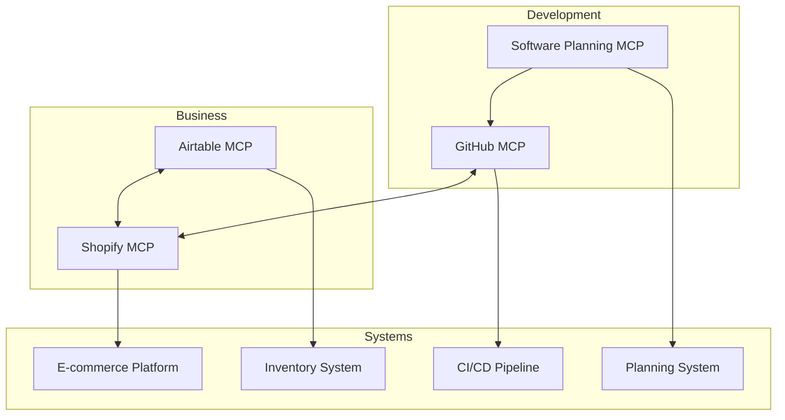

# Model Context Protocol (MCP) Integration

This directory contains documentation for Different Not Less Apparel's MCP integration. The Model Context Protocol (MCP) extends our capabilities by providing tools and resources that connect to external APIs and services.

## Overview

Different Not Less Apparel uses several MCP servers to automate and enhance various aspects of our development and business operations:

1. **GitHub MCP Server**: Automates code operations and CI/CD workflows
2. **Shopify MCP Server**: Manages product data and e-commerce operations
3. **Airtable MCP Server**: Handles inventory management and data storage
4. **Software Planning MCP**: Facilitates sprint planning and feature development

## Integration Architecture

## MCP Server Documentation

Each MCP server has its own documentation file in this directory:

- [GitHub MCP Workflows](./github-mcp-workflows.md): CI/CD automation, issue tracking, and code management
- [Shopify MCP Workflows](./shopify-mcp-workflows.md): Product management and e-commerce operations
- [Airtable MCP Workflows](./airtable-mcp-workflows.md): Inventory management and data storage
- [Software Planning Workflows](./software-planning-workflows.md): Sprint planning and feature development

## Cross-Platform Integration

We maintain consistent data across platforms through automated synchronization:

1. **Airtable ↔ Shopify**: Bidirectional sync for inventory and product data
2. **GitHub ↔ Software Planning**: Task tracking and implementation status
3. **GitHub → Shopify**: Deployment and release management

## Key Workflows

- [MCP Inventory Management](./mcp-inventory-management.md): Comprehensive inventory workflow
- CI/CD Pipeline: Automated testing, building, and deployment
- Product Synchronization: Keeping product data consistent across platforms

## Getting Started

To use MCP tools in your development workflow:

1. Ensure you have the necessary API keys and credentials
2. Follow the patterns documented in the `.clinerules` file
3. Use the appropriate MCP tools for each task as documented in this directory

## Best Practices

1. **Single Source of Truth**: Airtable is the primary data store for inventory
2. **Automated Synchronization**: Use MCP tools to keep systems in sync
3. **Consistent IDs**: Maintain consistent product IDs across platforms
4. **Error Handling**: Implement retry logic for failed synchronizations
5. **Documentation**: Keep MCP documentation updated with new patterns
