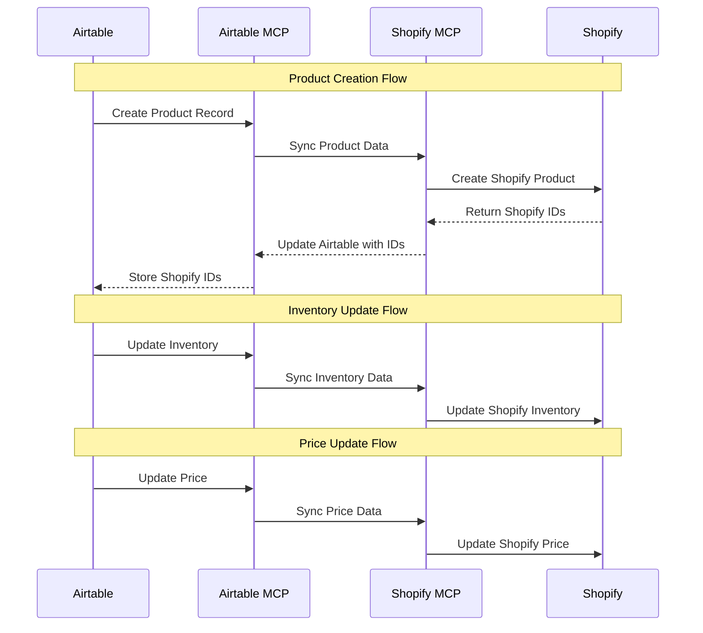

# Airtable MCP Workflows

This document outlines the Airtable MCP integration for Different Not Less Apparel, focusing on inventory management and data synchronization.

## Overview

The Airtable MCP server provides tools to interact with our Airtable bases, which serve as the primary data store for inventory management, product information, and customer data. This integration enables automated inventory tracking, product synchronization with Shopify, and data-driven decision making.

## Available Tools

The Airtable MCP server provides the following tools:

- `list_records`: List records from a table with optional filtering
- `search_records`: Search for records containing specific text
- `list_bases`: List all accessible Airtable bases
- `list_tables`: List all tables in a specific base
- `describe_table`: Get detailed information about a specific table
- `get_record`: Get a specific record by ID
- `create_record`: Create a new record in a table
- `update_records`: Update up to 10 records in a table
- `delete_records`: Delete records from a table
- `create_table`: Create a new table in a base
- `update_table`: Update a table's name or description
- `create_field`: Create a new field in a table

## Inventory Management Workflows

### 1. Inventory Monitoring Workflow

```mermaid
flowchart TD
    start[Start Monitoring] --> checkInventory[Check Inventory Levels]
    checkInventory --> evaluate{Evaluate Levels}
    evaluate -->|Below Threshold| alert[Create Alert]
    evaluate -->|Above Threshold| log[Log Status]
    
    alert --> notifyTeam[Notify Team]
    alert --> createReorder[Create Reorder Task]
    
    notifyTeam --> updateStatus[Update Status]
    createReorder --> updateStatus
    log --> updateStatus
    
    updateStatus --> end[End Monitoring Cycle]
```

#### Implementation:

```javascript
// Example: Check inventory levels and create alerts for low stock
async function monitorInventory(client) {
  try {
    // Get inventory records with low stock
    const lowStockItems = await client.callTool(
      "github.com/domdomegg/airtable-mcp-server",
      "list_records",
      {
        baseId: "applwPKN2KZFZ9JfW",
        tableId: "Inventory",
        filterByFormula: "{Inventory Count} <= {Reorder Threshold}"
      }
    );
    
    // Process low stock items
    for (const item of lowStockItems.records) {
      // Create alert in system
      await createLowStockAlert(item);
      
      // Log the alert
      console.log(`Low stock alert created for ${item.fields["Product"]}`);
    }
    
    return {
      monitored: lowStockItems.records.length,
      alerts: lowStockItems.records.length,
      timestamp: new Date().toISOString()
    };
  } catch (error) {
    console.error("Error monitoring inventory:", error);
    throw error;
  }
}
```

### 2. Product Creation Workflow

```mermaid
flowchart TD
    start[Start Product Creation] --> createProduct[Create Product in Airtable]
    createProduct --> createVariants[Create Variants]
    createVariants --> syncShopify[Sync to Shopify]
    syncShopify --> updateIds[Update IDs in Airtable]
    updateIds --> end[End Product Creation]
```

#### Implementation:

```javascript
// Example: Create a new product with variants
async function createProductWithVariants(client, productData, variants) {
  try {
    // Create product record
    const productRecord = await client.callTool(
      "github.com/domdomegg/airtable-mcp-server",
      "create_record",
      {
        baseId: "applwPKN2KZFZ9JfW",
        tableId: "Products",
        fields: {
          "Product Name": productData.name,
          "Description": productData.description,
          "Product Type": productData.type,
          "Price": productData.price,
          "Collections": productData.collections,
          "Status": "Available"
        }
      }
    );
    
    // Create variant records
    for (const variant of variants) {
      await client.callTool(
        "github.com/domdomegg/airtable-mcp-server",
        "create_record",
        {
          baseId: "applwPKN2KZFZ9JfW",
          tableId: "Inventory",
          fields: {
            "Product": [productRecord.id],
            "Size": variant.size,
            "Color": variant.color,
            "Inventory Count": variant.quantity,
            "Reorder Threshold": variant.reorderThreshold
          }
        }
      );
    }
    
    // Sync to Shopify (using our custom sync function)
    await syncProductToShopify(productRecord.id);
    
    return {
      success: true,
      productId: productRecord.id,
      variantsCreated: variants.length
    };
  } catch (error) {
    console.error("Error creating product:", error);
    throw error;
  }
}
```

### 3. Inventory Update Workflow

```mermaid
flowchart TD
    start[Start Inventory Update] --> getRecord[Get Inventory Record]
    getRecord --> updateQuantity[Update Quantity]
    updateQuantity --> checkThreshold{Check Threshold}
    checkThreshold -->|Below Threshold| flagLowStock[Flag Low Stock]
    checkThreshold -->|Above Threshold| syncShopify[Sync to Shopify]
    flagLowStock --> syncShopify
    syncShopify --> logUpdate[Log Update]
    logUpdate --> end[End Inventory Update]
```

#### Implementation:

```javascript
// Example: Update inventory quantity
async function updateInventoryQuantity(client, variantId, newQuantity) {
  try {
    // Get current inventory record
    const record = await client.callTool(
      "github.com/domdomegg/airtable-mcp-server",
      "get_record",
      {
        baseId: "applwPKN2KZFZ9JfW",
        tableId: "Inventory",
        recordId: variantId
      }
    );
    
    // Update quantity
    await client.callTool(
      "github.com/domdomegg/airtable-mcp-server",
      "update_records",
      {
        baseId: "applwPKN2KZFZ9JfW",
        tableId: "Inventory",
        records: [
          {
            id: variantId,
            fields: {
              "Inventory Count": newQuantity,
              "Last Inventory Update": new Date().toISOString()
            }
          }
        ]
      }
    );
    
    // Check if below threshold
    const reorderThreshold = record.fields["Reorder Threshold"] || 5;
    const isLowStock = newQuantity <= reorderThreshold;
    
    // Sync to Shopify
    await syncInventoryToShopify(variantId, newQuantity);
    
    return {
      success: true,
      variantId,
      newQuantity,
      isLowStock,
      timestamp: new Date().toISOString()
    };
  } catch (error) {
    console.error("Error updating inventory:", error);
    throw error;
  }
}
```

### 4. Inventory Reporting Workflow

```mermaid
flowchart TD
    start[Start Reporting] --> getInventory[Get All Inventory]
    getInventory --> calculateMetrics[Calculate Metrics]
    calculateMetrics --> generateReport[Generate Report]
    generateReport --> distributeReport[Distribute Report]
    distributeReport --> end[End Reporting]
```

#### Implementation:

```javascript
// Example: Generate inventory report
async function generateInventoryReport(client) {
  try {
    // Get all inventory records
    const inventory = await client.callTool(
      "github.com/domdomegg/airtable-mcp-server",
      "list_records",
      {
        baseId: "applwPKN2KZFZ9JfW",
        tableId: "Inventory",
        maxRecords: 1000
      }
    );
    
    // Calculate metrics
    const metrics = {
      totalItems: inventory.records.length,
      totalUnits: 0,
      lowStockItems: 0,
      valueAtCost: 0
    };
    
    // Process inventory records
    for (const item of inventory.records) {
      const count = item.fields["Inventory Count"] || 0;
      const threshold = item.fields["Reorder Threshold"] || 5;
      const cost = item.fields["Cost"] || 0;
      
      metrics.totalUnits += count;
      metrics.valueAtCost += count * cost;
      
      if (count <= threshold) {
        metrics.lowStockItems++;
      }
    }
    
    // Generate report
    const report = {
      metrics,
      timestamp: new Date().toISOString(),
      details: inventory.records.map(record => ({
        product: record.fields["Product"],
        variant: `${record.fields["Size"]} / ${record.fields["Color"]}`,
        count: record.fields["Inventory Count"],
        status: record.fields["Reorder Status"]
      }))
    };
    
    return report;
  } catch (error) {
    console.error("Error generating inventory report:", error);
    throw error;
  }
}
```

## Airtable-Shopify Synchronization

The Airtable MCP server works in conjunction with the Shopify MCP server to maintain consistent product and inventory data across both platforms.

### Bidirectional Sync Process



## MCP Integration Points

The Airtable MCP server integrates with other MCP servers:

1. **Shopify MCP**: For product and inventory synchronization
2. **GitHub MCP**: For issue creation on inventory alerts
3. **Software Planning MCP**: For creating tasks related to inventory management

## Best Practices

1. **Single Source of Truth**: Airtable is the primary data store for inventory
2. **Regular Synchronization**: Schedule regular syncs between Airtable and Shopify
3. **Error Handling**: Implement retry logic for failed operations
4. **Logging**: Maintain detailed logs of all inventory operations
5. **Threshold Management**: Regularly review and adjust reorder thresholds

## Implementation Examples

### Example 1: Get Low Stock Products

```javascript
const lowStockProducts = await client.callTool(
  "github.com/domdomegg/airtable-mcp-server",
  "list_records",
  {
    baseId: "applwPKN2KZFZ9JfW",
    tableId: "Inventory",
    filterByFormula: "{Inventory Count} <= {Reorder Threshold}"
  }
);
```

### Example 2: Update Product Status

```javascript
await client.callTool(
  "github.com/domdomegg/airtable-mcp-server",
  "update_records",
  {
    baseId: "applwPKN2KZFZ9JfW",
    tableId: "Products",
    records: [
      {
        id: "recXXXXXXXXXXXXXX",
        fields: {
          "Status": "Out of Stock"
        }
      }
    ]
  }
);
```

### Example 3: Search for Products by Collection

```javascript
const products = await client.callTool(
  "github.com/domdomegg/airtable-mcp-server",
  "search_records",
  {
    baseId: "applwPKN2KZFZ9JfW",
    tableId: "Products",
    searchTerm: "Your Words Matter",
    fieldIds: ["Collections"]
  }
);
