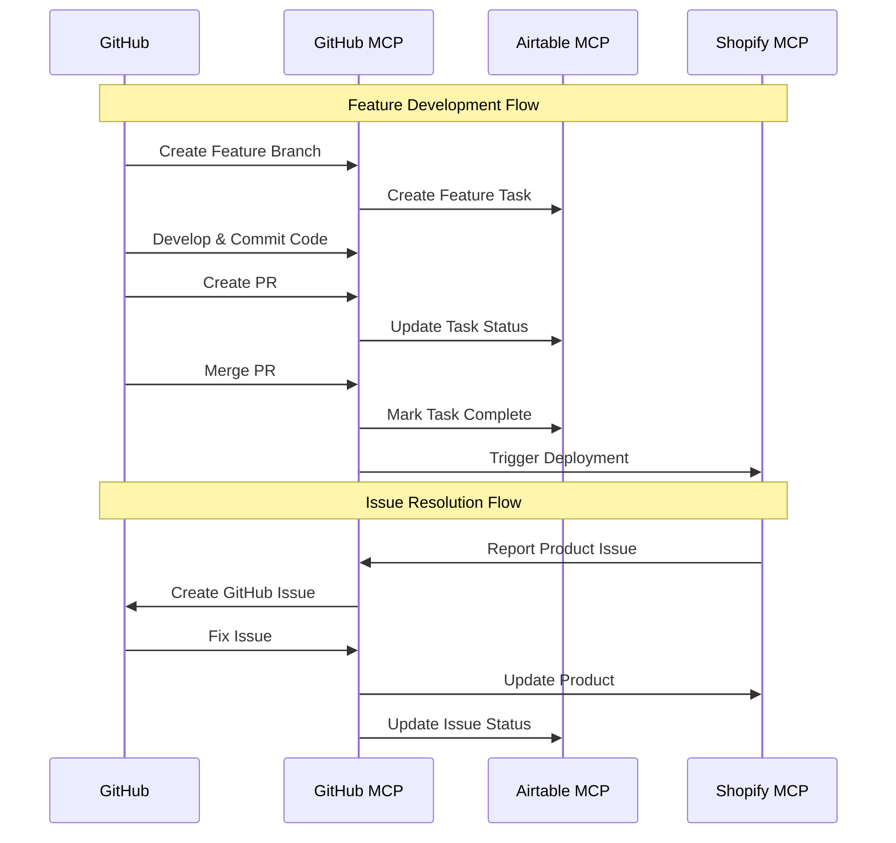

# GitHub MCP Workflows

This document outlines the GitHub MCP integration for Different Not Less Apparel, focusing on CI/CD automation, issue tracking, and code management.

## Overview

The GitHub MCP server provides tools to interact with our GitHub repositories, enabling automated CI/CD workflows, issue management, and code operations. This integration is central to our development process, ensuring consistent code quality, automated testing, and streamlined deployments.

## Available Tools

The GitHub MCP server provides the following tools:

- `create_or_update_file`: Create or update a single file in a GitHub repository
- `search_repositories`: Search for GitHub repositories
- `create_repository`: Create a new GitHub repository in your account
- `get_file_contents`: Get the contents of a file or directory from a GitHub repository
- `push_files`: Push multiple files to a GitHub repository in a single commit
- `create_issue`: Create a new issue in a GitHub repository
- `create_pull_request`: Create a new pull request in a GitHub repository
- `fork_repository`: Fork a GitHub repository to your account or specified organization
- `create_branch`: Create a new branch in a GitHub repository
- `list_commits`: Get list of commits of a branch in a GitHub repository
- `list_issues`: List issues in a GitHub repository with filtering options
- `update_issue`: Update an existing issue in a GitHub repository
- `add_issue_comment`: Add a comment to an existing issue
- `search_code`: Search for code across GitHub repositories
- `search_issues`: Search for issues and pull requests across GitHub repositories
- `search_users`: Search for users on GitHub
- `get_issue`: Get details of a specific issue in a GitHub repository
- `get_pull_request`: Get details of a specific pull request
- `list_pull_requests`: List and filter repository pull requests
- `create_pull_request_review`: Create a review on a pull request
- `merge_pull_request`: Merge a pull request
- `get_pull_request_files`: Get the list of files changed in a pull request
- `get_pull_request_status`: Get the combined status of all status checks for a pull request
- `update_pull_request_branch`: Update a pull request branch with the latest changes from the base branch
- `get_pull_request_comments`: Get the review comments on a pull request
- `get_pull_request_reviews`: Get the reviews on a pull request

## CI/CD Automation Workflows

### 1. Build Failure Reporting

```mermaid
flowchart TD
    start[CI Build Starts] --> runTests[Run Tests & Checks]
    runTests --> checkResult{Check Result}
    checkResult -->|Success| deployStep[Proceed to Deploy]
    checkResult -->|Failure| createIssue[Create GitHub Issue]
    
    createIssue --> assignIssue[Assign to Team Member]
    assignIssue --> notifyTeam[Notify Team]
    notifyTeam --> end[End Build Process]
    
    deployStep --> end
```

#### Implementation:

```javascript
// Example: Report failed builds by creating GitHub issues
async function reportFailedBuild(client, buildInfo) {
  try {
    const result = await client.callTool(
      "github.com/modelcontextprotocol/servers/tree/main/src/github", 
      "create_issue", 
      {
        owner: "madezmedia",
        repo: "different-not-less",
        title: `Build Failure: ${buildInfo.workflow}`,
        body: `
# Build Failure Report

## Build Information
- **Workflow**: ${buildInfo.workflow}
- **Run ID**: ${buildInfo.runId}
- **Branch**: ${buildInfo.branch}
- **Commit**: ${buildInfo.commit}
- **Timestamp**: ${new Date().toISOString()}

## Error Details
\`\`\`
${buildInfo.error}
\`\`\`

## Failed Step
${buildInfo.failedStep}

## Possible Solutions
1. Check the error message for syntax or dependency issues
2. Verify environment variables are correctly set
3. Check for recent changes that might have caused the failure

[View Workflow Run](https://github.com/madezmedia/different-not-less/actions/runs/${buildInfo.runId})
        `,
        labels: ["bug", "build-failure", "ci-cd"],
        assignees: ["michaelshaw"]
      }
    );
    
    console.log("Created issue for failed build:", result.html_url);
    return result;
  } catch (error) {
    console.error("Error creating issue for failed build:", error);
    throw error;
  }
}
```

### 2. Automated PR Management

```mermaid
flowchart TD
    start[PR Created] --> runCI[Run CI Checks]
    runCI --> checkStatus{Check Status}
    checkStatus -->|All Passed| reviewStatus{Review Status}
    checkStatus -->|Some Failed| notifyAuthor[Notify Author]
    
    reviewStatus -->|Approved| mergePR[Auto-Merge PR]
    reviewStatus -->|Not Approved| waitForApproval[Wait for Approval]
    
    mergePR --> updateBranch[Update Branch]
    updateBranch --> deployChanges[Deploy Changes]
    deployChanges --> end[End PR Process]
    
    notifyAuthor --> end
    waitForApproval --> end
```

#### Implementation:

```javascript
// Example: Automatically merge PRs that pass all checks
async function autoPRMerge(client, prInfo) {
  try {
    // First, check if all checks have passed
    const checksResult = await client.callTool(
      "github.com/modelcontextprotocol/servers/tree/main/src/github",
      "get_pull_request_status",
      {
        owner: "madezmedia",
        repo: "different-not-less",
        pull_number: prInfo.number
      }
    );
    
    // Only proceed if all checks have passed
    if (checksResult.state === "success") {
      // Merge the PR
      const mergeResult = await client.callTool(
        "github.com/modelcontextprotocol/servers/tree/main/src/github",
        "merge_pull_request",
        {
          owner: "madezmedia",
          repo: "different-not-less",
          pull_number: prInfo.number,
          commit_title: `Auto-merge PR #${prInfo.number}: ${prInfo.title}`,
          commit_message: `Automatically merged PR #${prInfo.number} after all checks passed.`,
          merge_method: "squash"
        }
      );
      
      console.log("Auto-merged PR:", prInfo.number);
      return mergeResult;
    } else {
      console.log(`Not merging PR #${prInfo.number} - checks state: ${checksResult.state}`);
      return { merged: false, reason: `Checks state: ${checksResult.state}` };
    }
  } catch (error) {
    console.error("Error auto-merging PR:", error);
    throw error;
  }
}
```

### 3. Deployment Tracking

```mermaid
flowchart TD
    start[Deployment Starts] --> deployEnv{Environment}
    deployEnv -->|Staging| stagingDeploy[Deploy to Staging]
    deployEnv -->|Production| prodDeploy[Deploy to Production]
    
    stagingDeploy --> recordStaging[Record Staging Deployment]
    prodDeploy --> recordProd[Record Production Deployment]
    
    recordStaging --> notifyStaging[Notify Team]
    recordProd --> notifyProd[Notify Team]
    
    notifyStaging --> end[End Deployment Process]
    notifyProd --> end
```

#### Implementation:

```javascript
// Example: Update deployment status
async function updateDeploymentStatus(client, deployInfo) {
  try {
    // Create a comment on the commit
    const result = await client.callTool(
      "github.com/modelcontextprotocol/servers/tree/main/src/github",
      "create_or_update_file",
      {
        owner: "madezmedia",
        repo: "different-not-less",
        path: `deployments/${deployInfo.environment}/${deployInfo.id}.json`,
        content: JSON.stringify({
          id: deployInfo.id,
          environment: deployInfo.environment,
          status: deployInfo.status,
          timestamp: new Date().toISOString(),
          commit: deployInfo.commit,
          url: deployInfo.url
        }, null, 2),
        message: `Deployment update: ${deployInfo.environment} - ${deployInfo.status}`,
        branch: "main"
      }
    );
    
    console.log("Updated deployment status:", result);
    return result;
  } catch (error) {
    console.error("Error updating deployment status:", error);
    throw error;
  }
}
```

### 4. Rollback Process

```mermaid
flowchart TD
    start[Issue Detected] --> identifyIssue[Identify Issue]
    identifyIssue --> decideRollback{Decide Rollback}
    decideRollback -->|Yes| createRollbackBranch[Create Rollback Branch]
    decideRollback -->|No| fixForward[Fix Forward]
    
    createRollbackBranch --> createPR[Create Rollback PR]
    createPR --> expediteApproval[Expedite Approval]
    expediteApproval --> mergePR[Merge PR]
    mergePR --> deployRollback[Deploy Rollback]
    deployRollback --> documentIncident[Document Incident]
    documentIncident --> end[End Rollback Process]
    
    fixForward --> end
```

#### Implementation:

```javascript
// Example: Create a rollback PR if needed
async function createRollbackPR(client, rollbackInfo) {
  try {
    // Create a new branch for the rollback
    const branchName = `rollback/${rollbackInfo.environment}-${rollbackInfo.timestamp}`;
    
    await client.callTool(
      "github.com/modelcontextprotocol/servers/tree/main/src/github",
      "create_branch",
      {
        owner: "madezmedia",
        repo: "different-not-less",
        branch: branchName,
        from_branch: rollbackInfo.targetCommit
      }
    );
    
    // Create a PR for the rollback
    const prResult = await client.callTool(
      "github.com/modelcontextprotocol/servers/tree/main/src/github",
      "create_pull_request",
      {
        owner: "madezmedia",
        repo: "different-not-less",
        title: `ROLLBACK: ${rollbackInfo.environment} to ${rollbackInfo.targetCommit.substring(0, 7)}`,
        body: `
# Emergency Rollback

This PR rolls back the ${rollbackInfo.environment} environment to commit ${rollbackInfo.targetCommit}.

## Reason for Rollback
${rollbackInfo.reason}

## Affected Systems
${rollbackInfo.affectedSystems.join(", ")}

## Steps After Merging
1. Verify the rollback resolves the issue
2. Create a new issue to address the root cause
3. Document the incident in the post-mortem log
        `,
        head: branchName,
        base: "main"
      }
    );
    
    console.log("Created rollback PR:", prResult.html_url);
    return prResult;
  } catch (error) {
    console.error("Error creating rollback PR:", error);
    throw error;
  }
}
```

## Issue Management Workflows

### 1. Issue Tracking and Assignment

```mermaid
flowchart TD
    start[Issue Created] --> categorizeIssue[Categorize Issue]
    categorizeIssue --> prioritizeIssue[Prioritize Issue]
    prioritizeIssue --> assignIssue[Assign to Team Member]
    assignIssue --> trackProgress[Track Progress]
    trackProgress --> resolveIssue[Resolve Issue]
    resolveIssue --> end[Close Issue]
```

#### Implementation:

```javascript
// Example: Create and assign an issue
async function createAndAssignIssue(client, issueInfo) {
  try {
    // Create the issue
    const issue = await client.callTool(
      "github.com/modelcontextprotocol/servers/tree/main/src/github",
      "create_issue",
      {
        owner: "madezmedia",
        repo: "different-not-less",
        title: issueInfo.title,
        body: issueInfo.description,
        labels: issueInfo.labels,
        assignees: issueInfo.assignees
      }
    );
    
    // Add a comment with additional information
    if (issueInfo.additionalInfo) {
      await client.callTool(
        "github.com/modelcontextprotocol/servers/tree/main/src/github",
        "add_issue_comment",
        {
          owner: "madezmedia",
          repo: "different-not-less",
          issue_number: issue.number,
          body: issueInfo.additionalInfo
        }
      );
    }
    
    return {
      success: true,
      issueNumber: issue.number,
      issueUrl: issue.html_url
    };
  } catch (error) {
    console.error("Error creating and assigning issue:", error);
    throw error;
  }
}
```

### 2. PR Review Process

```mermaid
flowchart TD
    start[PR Submitted] --> assignReviewers[Assign Reviewers]
    assignReviewers --> reviewCode[Review Code]
    reviewCode --> reviewDecision{Review Decision}
    reviewDecision -->|Approve| mergePR[Merge PR]
    reviewDecision -->|Request Changes| addressFeedback[Address Feedback]
    
    addressFeedback --> reviewCode
    mergePR --> end[End PR Process]
```

#### Implementation:

```javascript
// Example: Create a PR review
async function createPRReview(client, reviewInfo) {
  try {
    // Create the review
    const review = await client.callTool(
      "github.com/modelcontextprotocol/servers/tree/main/src/github",
      "create_pull_request_review",
      {
        owner: "madezmedia",
        repo: "different-not-less",
        pull_number: reviewInfo.pullNumber,
        body: reviewInfo.comments,
        event: reviewInfo.decision // "APPROVE", "REQUEST_CHANGES", or "COMMENT"
      }
    );
    
    return {
      success: true,
      reviewId: review.id,
      decision: reviewInfo.decision
    };
  } catch (error) {
    console.error("Error creating PR review:", error);
    throw error;
  }
}
```

## Code Management Workflows

### 1. Branch Management

```mermaid
flowchart TD
    start[Start Branch Management] --> createBranch[Create Feature Branch]
    createBranch --> developFeature[Develop Feature]
    developFeature --> createPR[Create PR]
    createPR --> reviewProcess[Review Process]
    reviewProcess --> mergeBranch[Merge Branch]
    mergeBranch --> deleteBranch[Delete Branch]
    deleteBranch --> end[End Branch Management]
```

#### Implementation:

```javascript
// Example: Create a new feature branch
async function createFeatureBranch(client, featureInfo) {
  try {
    // Create the branch
    await client.callTool(
      "github.com/modelcontextprotocol/servers/tree/main/src/github",
      "create_branch",
      {
        owner: "madezmedia",
        repo: "different-not-less",
        branch: `feature/DNL-${featureInfo.ticketNumber}-${featureInfo.description.toLowerCase().replace(/\s+/g, '-')}`,
        from_branch: "development" // Create from development branch
      }
    );
    
    return {
      success: true,
      branchName: `feature/DNL-${featureInfo.ticketNumber}-${featureInfo.description.toLowerCase().replace(/\s+/g, '-')}`,
      baseBranch: "development"
    };
  } catch (error) {
    console.error("Error creating feature branch:", error);
    throw error;
  }
}
```

### 2. File Management

```mermaid
flowchart TD
    start[Start File Management] --> identifyFiles[Identify Files to Change]
    identifyFiles --> getContents[Get File Contents]
    getContents --> modifyContents[Modify Contents]
    modifyContents --> commitChanges[Commit Changes]
    commitChanges --> createPR[Create PR]
    createPR --> end[End File Management]
```

#### Implementation:

```javascript
// Example: Update multiple files in a single commit
async function updateMultipleFiles(client, updateInfo) {
  try {
    // Push multiple files
    const result = await client.callTool(
      "github.com/modelcontextprotocol/servers/tree/main/src/github",
      "push_files",
      {
        owner: "madezmedia",
        repo: "different-not-less",
        branch: updateInfo.branch,
        files: updateInfo.files,
        message: updateInfo.commitMessage
      }
    );
    
    return {
      success: true,
      commit: result.commit,
      filesUpdated: updateInfo.files.length
    };
  } catch (error) {
    console.error("Error updating multiple files:", error);
    throw error;
  }
}
```

## GitHub-Airtable-Shopify Integration

The GitHub MCP server works in conjunction with the Airtable and Shopify MCP servers to create a comprehensive development and deployment workflow.

### Cross-Platform Integration Flow



## MCP Integration Points

The GitHub MCP server integrates with other MCP servers:

1. **Airtable MCP**: For task tracking and project management
2. **Shopify MCP**: For deployment and release management
3. **Software Planning MCP**: For feature planning and implementation

## Best Practices

1. **Branch Naming**: Follow the convention `feature/DNL-[number]-[description]`
2. **Commit Messages**: Use descriptive commit messages with ticket numbers
3. **PR Reviews**: Require at least one approval before merging
4. **CI Checks**: Ensure all CI checks pass before merging
5. **Documentation**: Keep documentation updated with code changes

## Implementation Examples

### Example 1: Create a New Issue

```javascript
const issue = await client.callTool(
  "github.com/modelcontextprotocol/servers/tree/main/src/github",
  "create_issue",
  {
    owner: "madezmedia",
    repo: "different-not-less",
    title: "[DNL-123] Add new product filter component",
    body: "We need to add a new product filter component to the product listing page to allow users to filter products by size and color.",
    labels: ["enhancement", "frontend"],
    assignees: ["developer-username"]
  }
);
```

### Example 2: Create a Pull Request

```javascript
const pr = await client.callTool(
  "github.com/modelcontextprotocol/servers/tree/main/src/github",
  "create_pull_request",
  {
    owner: "madezmedia",
    repo: "different-not-less",
    title: "[DNL-123] Add product filter component",
    body: "This PR adds a new product filter component to the product listing page.\n\n## Changes\n- Added ProductFilter component\n- Updated ProductList to use filter\n- Added unit tests\n\n## How to Test\n1. Go to the product listing page\n2. Use the filter to filter products by size and color\n\n## Screenshots\n",
    head: "feature/DNL-123-product-filter",
    base: "development"
  }
);
```

### Example 3: Get Pull Request Status

```javascript
const status = await client.callTool(
  "github.com/modelcontextprotocol/servers/tree/main/src/github",
  "get_pull_request_status",
  {
    owner: "madezmedia",
    repo: "different-not-less",
    pull_number: 123
  }
);
