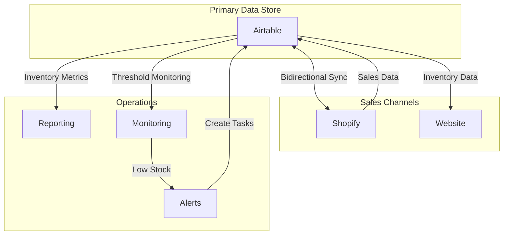
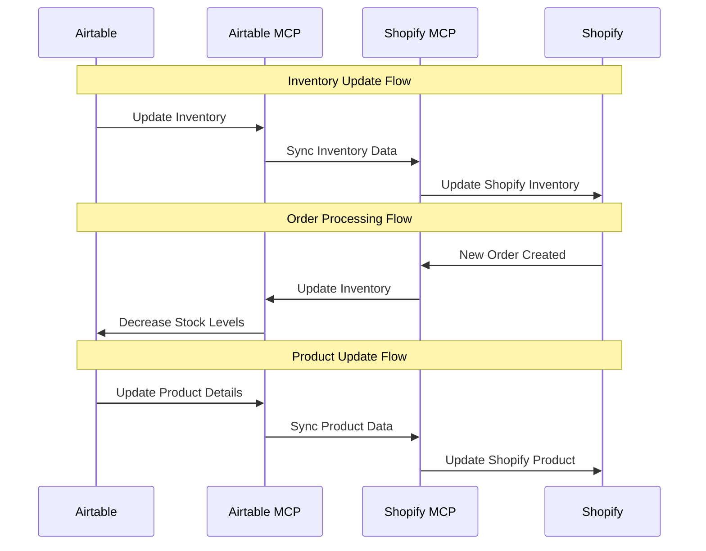
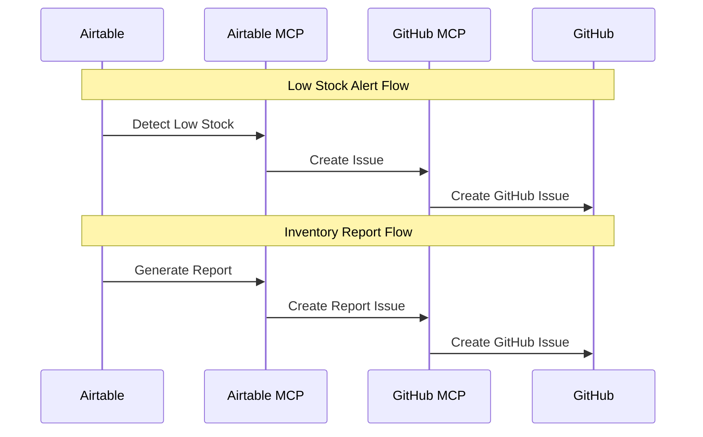

# MCP Inventory Management

This document outlines the comprehensive inventory management workflow for Different Not Less Apparel, leveraging multiple MCP servers to create a seamless inventory system.

## Overview

Our inventory management system uses a combination of MCP servers to maintain accurate inventory data across platforms:

1. **Airtable MCP**: Primary data store for inventory information
2. **Shopify MCP**: E-commerce platform for customer-facing inventory
3. **GitHub MCP**: CI/CD automation for deployment and monitoring
4. **Software Planning MCP**: Feature planning for inventory system improvements

This integration ensures consistent inventory data, automated synchronization, and robust error handling.

## Inventory Data Flow



## Core Inventory Workflows

### 1. Inventory Creation Workflow

```mermaid
flowchart TD
    start[Start Inventory Creation] --> createProduct[Create Product in Airtable]
    createProduct --> createVariants[Create Variants in Airtable]
    createVariants --> syncShopify[Sync to Shopify]
    syncShopify --> updateWebsite[Update Website]
    updateWebsite --> end[End Inventory Creation]
```

#### Implementation:

```javascript
// Example: Create new inventory items
async function createInventoryItems(client, productData, variants) {
  try {
    // Step 1: Create product in Airtable
    const productRecord = await client.callTool(
      "github.com/domdomegg/airtable-mcp-server",
      "create_record",
      {
        baseId: "applwPKN2KZFZ9JfW",
        tableId: "Products",
        fields: {
          "Product Name": productData.name,
          "Description": productData.description,
          "Product Type": productData.type,
          "Price": productData.price,
          "Collections": productData.collections,
          "Status": "Available"
        }
      }
    );
    
    // Step 2: Create variants in Airtable
    const variantRecords = [];
    for (const variant of variants) {
      const variantRecord = await client.callTool(
        "github.com/domdomegg/airtable-mcp-server",
        "create_record",
        {
          baseId: "applwPKN2KZFZ9JfW",
          tableId: "Inventory",
          fields: {
            "Product": [productRecord.id],
            "Size": variant.size,
            "Color": variant.color,
            "Inventory Count": variant.quantity,
            "Reorder Threshold": variant.reorderThreshold,
            "SKU": `${productData.sku}-${variant.size}-${variant.color.replace(/\s+/g, '-').toLowerCase()}`
          }
        }
      );
      variantRecords.push(variantRecord);
    }
    
    // Step 3: Sync to Shopify
    // This is a simplified example. In reality, you would use a different
    // endpoint to create products in Shopify, which isn't shown in the available tools.
    console.log("Syncing product to Shopify");
    
    // Step 4: Update website
    // This would typically be handled by the Shopify integration with the website
    
    return {
      success: true,
      productId: productRecord.id,
      variantIds: variantRecords.map(record => record.id),
      variantsCreated: variants.length
    };
  } catch (error) {
    console.error("Error creating inventory items:", error);
    throw error;
  }
}
```

### 2. Inventory Update Workflow

```mermaid
flowchart TD
    start[Start Inventory Update] --> getInventory[Get Current Inventory]
    getInventory --> updateQuantity[Update Quantity]
    updateQuantity --> syncShopify[Sync to Shopify]
    syncShopify --> checkThreshold{Check Threshold}
    checkThreshold -->|Below Threshold| createAlert[Create Alert]
    checkThreshold -->|Above Threshold| logUpdate[Log Update]
    createAlert --> notifyTeam[Notify Team]
    notifyTeam --> createTask[Create Restock Task]
    createTask --> end[End Inventory Update]
    logUpdate --> end
```

#### Implementation:

```javascript
// Example: Update inventory quantity
async function updateInventoryQuantity(client, variantId, newQuantity) {
  try {
    // Step 1: Get current inventory
    const record = await client.callTool(
      "github.com/domdomegg/airtable-mcp-server",
      "get_record",
      {
        baseId: "applwPKN2KZFZ9JfW",
        tableId: "Inventory",
        recordId: variantId
      }
    );
    
    // Step 2: Update quantity in Airtable
    await client.callTool(
      "github.com/domdomegg/airtable-mcp-server",
      "update_records",
      {
        baseId: "applwPKN2KZFZ9JfW",
        tableId: "Inventory",
        records: [
          {
            id: variantId,
            fields: {
              "Inventory Count": newQuantity,
              "Last Inventory Update": new Date().toISOString()
            }
          }
        ]
      }
    );
    
    // Step 3: Sync to Shopify
    // This is a simplified example. In reality, you would use a different
    // endpoint to update inventory in Shopify, which isn't shown in the available tools.
    console.log(`Syncing inventory update to Shopify for variant ${variantId}`);
    
    // Step 4: Check threshold
    const reorderThreshold = record.fields["Reorder Threshold"] || 5;
    const isLowStock = newQuantity <= reorderThreshold;
    
    if (isLowStock) {
      // Step 5a: Create alert
      await createLowStockAlert(client, record, newQuantity);
      
      // Step 6a: Notify team
      await notifyTeamOfLowStock(client, record, newQuantity);
      
      // Step 7a: Create restock task
      await createRestockTask(client, record, newQuantity);
    } else {
      // Step 5b: Log update
      console.log(`Inventory updated for ${record.fields["Product"]} - ${record.fields["Size"]} - ${record.fields["Color"]}: ${newQuantity}`);
    }
    
    return {
      success: true,
      variantId,
      newQuantity,
      isLowStock,
      timestamp: new Date().toISOString()
    };
  } catch (error) {
    console.error("Error updating inventory quantity:", error);
    throw error;
  }
}

// Helper function to create a low stock alert
async function createLowStockAlert(client, record, quantity) {
  try {
    // Create an alert in Airtable
    await client.callTool(
      "github.com/domdomegg/airtable-mcp-server",
      "create_record",
      {
        baseId: "applwPKN2KZFZ9JfW",
        tableId: "Inventory Alerts",
        fields: {
          "Product": record.fields["Product"],
          "Variant": `${record.fields["Size"]} - ${record.fields["Color"]}`,
          "Current Quantity": quantity,
          "Threshold": record.fields["Reorder Threshold"],
          "Alert Type": "Low Stock",
          "Status": "Open",
          "Created At": new Date().toISOString()
        }
      }
    );
    
    return { success: true };
  } catch (error) {
    console.error("Error creating low stock alert:", error);
    throw error;
  }
}

// Helper function to notify team of low stock
async function notifyTeamOfLowStock(client, record, quantity) {
  try {
    // Create a GitHub issue for the low stock
    await client.callTool(
      "github.com/modelcontextprotocol/servers/tree/main/src/github",
      "create_issue",
      {
        owner: "madezmedia",
        repo: "different-not-less",
        title: `Low Stock Alert: ${record.fields["Product"]} - ${record.fields["Size"]} - ${record.fields["Color"]}`,
        body: `
# Low Stock Alert

## Product Information
- **Product**: ${record.fields["Product"]}
- **Variant**: ${record.fields["Size"]} - ${record.fields["Color"]}
- **SKU**: ${record.fields["SKU"]}
- **Current Quantity**: ${quantity}
- **Reorder Threshold**: ${record.fields["Reorder Threshold"]}
- **Last Updated**: ${new Date().toISOString()}

## Action Required
Please restock this item as soon as possible.

## Reorder Information
- **Supplier**: ${record.fields["Supplier"] || "Not specified"}
- **Lead Time**: ${record.fields["Lead Time"] || "Not specified"}
- **Reorder Quantity**: ${record.fields["Reorder Quantity"] || "Not specified"}
        `,
        labels: ["inventory", "low-stock", "needs-attention"]
      }
    );
    
    return { success: true };
  } catch (error) {
    console.error("Error notifying team of low stock:", error);
    throw error;
  }
}

// Helper function to create a restock task
async function createRestockTask(client, record, quantity) {
  try {
    // Create a task in the Software Planning MCP
    await client.callTool(
      "github.com/NightTrek/Software-planning-mcp",
      "start_planning",
      {
        originalRequest: `Restock ${record.fields["Product"]} - ${record.fields["Size"]} - ${record.fields["Color"]}`,
        splitDetails: `Current quantity: ${quantity}, Threshold: ${record.fields["Reorder Threshold"]}`,
        tasks: [
          {
            title: "Contact Supplier",
            description: `Contact the supplier to order more of ${record.fields["Product"]} - ${record.fields["Size"]} - ${record.fields["Color"]}.`
          },
          {
            title: "Place Order",
            description: `Place an order for ${record.fields["Reorder Quantity"] || "appropriate quantity"} of ${record.fields["Product"]} - ${record.fields["Size"]} - ${record.fields["Color"]}.`
          },
          {
            title: "Track Shipment",
            description: "Track the shipment and update the expected arrival date."
          },
          {
            title: "Receive Inventory",
            description: "Receive the inventory and update the inventory count in Airtable."
          }
        ]
      }
    );
    
    return { success: true };
  } catch (error) {
    console.error("Error creating restock task:", error);
    throw error;
  }
}
```

### 3. Inventory Reconciliation Workflow

```mermaid
flowchart TD
    start[Start Reconciliation] --> getAirtable[Get Airtable Inventory]
    getAirtable --> getShopify[Get Shopify Inventory]
    getShopify --> compareInventory[Compare Inventories]
    compareInventory --> identifyDiscrepancies[Identify Discrepancies]
    identifyDiscrepancies --> resolveDiscrepancies[Resolve Discrepancies]
    resolveDiscrepancies --> updateAirtable[Update Airtable]
    updateAirtable --> updateShopify[Update Shopify]
    updateShopify --> logReconciliation[Log Reconciliation]
    logReconciliation --> end[End Reconciliation]
```

#### Implementation:

```javascript
// Example: Reconcile inventory between Airtable and Shopify
async function reconcileInventory(client) {
  try {
    // Step 1: Get Airtable inventory
    const airtableInventory = await client.callTool(
      "github.com/domdomegg/airtable-mcp-server",
      "list_records",
      {
        baseId: "applwPKN2KZFZ9JfW",
        tableId: "Inventory",
        maxRecords: 1000
      }
    );
    
    // Step 2: Get Shopify inventory
    // This is a simplified example. In reality, you would use a different
    // endpoint to get inventory from Shopify, which isn't shown in the available tools.
    console.log("Getting inventory from Shopify");
    const shopifyInventory = []; // Placeholder for actual Shopify inventory
    
    // Step 3: Compare inventories
    const discrepancies = [];
    for (const airtableItem of airtableInventory.records) {
      const shopifyItem = shopifyInventory.find(item => item.sku === airtableItem.fields["SKU"]);
      
      if (!shopifyItem) {
        // Item exists in Airtable but not in Shopify
        discrepancies.push({
          sku: airtableItem.fields["SKU"],
          type: "missing_in_shopify",
          airtableQuantity: airtableItem.fields["Inventory Count"],
          shopifyQuantity: 0,
          airtableRecord: airtableItem
        });
      } else if (shopifyItem.inventory_quantity !== airtableItem.fields["Inventory Count"]) {
        // Quantities don't match
        discrepancies.push({
          sku: airtableItem.fields["SKU"],
          type: "quantity_mismatch",
          airtableQuantity: airtableItem.fields["Inventory Count"],
          shopifyQuantity: shopifyItem.inventory_quantity,
          airtableRecord: airtableItem,
          shopifyRecord: shopifyItem
        });
      }
    }
    
    // Check for items in Shopify but not in Airtable
    for (const shopifyItem of shopifyInventory) {
      const airtableItem = airtableInventory.records.find(item => item.fields["SKU"] === shopifyItem.sku);
      
      if (!airtableItem) {
        discrepancies.push({
          sku: shopifyItem.sku,
          type: "missing_in_airtable",
          airtableQuantity: 0,
          shopifyQuantity: shopifyItem.inventory_quantity,
          shopifyRecord: shopifyItem
        });
      }
    }
    
    // Step 4: Resolve discrepancies
    for (const discrepancy of discrepancies) {
      switch (discrepancy.type) {
        case "missing_in_shopify":
          // Create item in Shopify
          console.log(`Creating item in Shopify: ${discrepancy.sku}`);
          break;
          
        case "missing_in_airtable":
          // Create item in Airtable
          console.log(`Creating item in Airtable: ${discrepancy.sku}`);
          break;
          
        case "quantity_mismatch":
          // Determine which quantity is correct
          // For this example, we'll assume Airtable is the source of truth
          console.log(`Updating Shopify quantity for ${discrepancy.sku}: ${discrepancy.airtableQuantity}`);
          break;
      }
    }
    
    // Step 5: Log reconciliation
    await client.callTool(
      "github.com/domdomegg/airtable-mcp-server",
      "create_record",
      {
        baseId: "applwPKN2KZFZ9JfW",
        tableId: "Inventory Reconciliations",
        fields: {
          "Date": new Date().toISOString(),
          "Discrepancies Found": discrepancies.length,
          "Discrepancies Resolved": discrepancies.length,
          "Notes": `Reconciled inventory between Airtable and Shopify. Found ${discrepancies.length} discrepancies.`
        }
      }
    );
    
    return {
      success: true,
      discrepanciesFound: discrepancies.length,
      discrepanciesResolved: discrepancies.length,
      timestamp: new Date().toISOString()
    };
  } catch (error) {
    console.error("Error reconciling inventory:", error);
    throw error;
  }
}
```

### 4. Inventory Reporting Workflow

```mermaid
flowchart TD
    start[Start Reporting] --> getInventory[Get Inventory Data]
    getInventory --> calculateMetrics[Calculate Metrics]
    calculateMetrics --> generateReport[Generate Report]
    generateReport --> distributeReport[Distribute Report]
    distributeReport --> end[End Reporting]
```

#### Implementation:

```javascript
// Example: Generate inventory report
async function generateInventoryReport(client) {
  try {
    // Step 1: Get inventory data
    const inventory = await client.callTool(
      "github.com/domdomegg/airtable-mcp-server",
      "list_records",
      {
        baseId: "applwPKN2KZFZ9JfW",
        tableId: "Inventory",
        maxRecords: 1000
      }
    );
    
    // Step 2: Calculate metrics
    const metrics = {
      totalItems: inventory.records.length,
      totalUnits: 0,
      lowStockItems: 0,
      valueAtCost: 0,
      valueAtRetail: 0
    };
    
    // Process inventory records
    for (const item of inventory.records) {
      const count = item.fields["Inventory Count"] || 0;
      const threshold = item.fields["Reorder Threshold"] || 5;
      const cost = item.fields["Cost"] || 0;
      const price = item.fields["Price"] || 0;
      
      metrics.totalUnits += count;
      metrics.valueAtCost += count * cost;
      metrics.valueAtRetail += count * price;
      
      if (count <= threshold) {
        metrics.lowStockItems++;
      }
    }
    
    // Step 3: Generate report
    const report = {
      title: "Inventory Status Report",
      date: new Date().toISOString(),
      metrics,
      lowStockItems: inventory.records
        .filter(item => (item.fields["Inventory Count"] || 0) <= (item.fields["Reorder Threshold"] || 5))
        .map(item => ({
          product: item.fields["Product"],
          variant: `${item.fields["Size"]} - ${item.fields["Color"]}`,
          sku: item.fields["SKU"],
          count: item.fields["Inventory Count"],
          threshold: item.fields["Reorder Threshold"]
        })),
      topSellingItems: inventory.records
        .sort((a, b) => (b.fields["Units Sold"] || 0) - (a.fields["Units Sold"] || 0))
        .slice(0, 10)
        .map(item => ({
          product: item.fields["Product"],
          variant: `${item.fields["Size"]} - ${item.fields["Color"]}`,
          sku: item.fields["SKU"],
          unitsSold: item.fields["Units Sold"] || 0
        }))
    };
    
    // Step 4: Distribute report
    // Save report to Airtable
    await client.callTool(
      "github.com/domdomegg/airtable-mcp-server",
      "create_record",
      {
        baseId: "applwPKN2KZFZ9JfW",
        tableId: "Inventory Reports",
        fields: {
          "Date": report.date,
          "Total Items": metrics.totalItems,
          "Total Units": metrics.totalUnits,
          "Low Stock Items": metrics.lowStockItems,
          "Value at Cost": metrics.valueAtCost,
          "Value at Retail": metrics.valueAtRetail,
          "Report Data": JSON.stringify(report)
        }
      }
    );
    
    // Create GitHub issue with report
    await client.callTool(
      "github.com/modelcontextprotocol/servers/tree/main/src/github",
      "create_issue",
      {
        owner: "madezmedia",
        repo: "different-not-less",
        title: `Inventory Status Report - ${new Date().toLocaleDateString()}`,
        body: `
# Inventory Status Report

## Summary
- **Date**: ${new Date().toLocaleDateString()}
- **Total Items**: ${metrics.totalItems}
- **Total Units**: ${metrics.totalUnits}
- **Low Stock Items**: ${metrics.lowStockItems}
- **Value at Cost**: $${metrics.valueAtCost.toFixed(2)}
- **Value at Retail**: $${metrics.valueAtRetail.toFixed(2)}

## Low Stock Items
${report.lowStockItems.map(item => `- **${item.product} (${item.variant})**: ${item.count}/${item.threshold}`).join('\n')}

## Top Selling Items
${report.topSellingItems.map(item => `- **${item.product} (${item.variant})**: ${item.unitsSold} units sold`).join('\n')}
        `,
        labels: ["inventory", "report"]
      }
    );
    
    return {
      success: true,
      report
    };
  } catch (error) {
    console.error("Error generating inventory report:", error);
    throw error;
  }
}
```

## Order Processing Workflow

```mermaid
flowchart TD
    start[Order Received] --> validateOrder[Validate Order]
    validateOrder --> checkInventory[Check Inventory]
    checkInventory --> processPayment[Process Payment]
    processPayment --> updateInventory[Update Inventory]
    updateInventory --> createShipment[Create Shipment]
    createShipment --> notifyCustomer[Notify Customer]
    notifyCustomer --> end[End Order Processing]
```

#### Implementation:

```javascript
// Example: Process a new order
async function processOrder(client, orderData) {
  try {
    // Step 1: Validate order
    // This would typically be handled by Shopify
    
    // Step 2: Check inventory
    const inventoryCheck = await checkInventoryForOrder(client, orderData.lineItems);
    
    if (!inventoryCheck.success) {
      // Handle inventory issues
      return {
        success: false,
        reason: "inventory_issues",
        outOfStockItems: inventoryCheck.outOfStockItems
      };
    }
    
    // Step 3: Process payment
    // This would typically be handled by Shopify
    
    // Step 4: Update inventory
    await updateInventoryForOrder(client, orderData.lineItems);
    
    // Step 5: Create shipment
    // This would typically be handled by a shipping integration
    
    // Step 6: Notify customer
    // This would typically be handled by Shopify
    
    return {
      success: true,
      orderId: orderData.id,
      orderNumber: orderData.orderNumber,
      customer: orderData.customer,
      lineItems: orderData.lineItems,
      timestamp: new Date().toISOString()
    };
  } catch (error) {
    console.error("Error processing order:", error);
    throw error;
  }
}

// Helper function to check inventory for an order
async function checkInventoryForOrder(client, lineItems) {
  try {
    const outOfStockItems = [];
    
    for (const item of lineItems) {
      // Get inventory for the item
      const inventory = await client.callTool(
        "github.com/domdomegg/airtable-mcp-server",
        "list_records",
        {
          baseId: "applwPKN2KZFZ9JfW",
          tableId: "Inventory",
          filterByFormula: `{SKU} = "${item.sku}"`
        }
      );
      
      if (inventory.records.length === 0) {
        // Item not found
        outOfStockItems.push({
          sku: item.sku,
          reason: "not_found"
        });
      } else {
        const inventoryItem = inventory.records[0];
        const availableQuantity = inventoryItem.fields["Inventory Count"] || 0;
        
        if (availableQuantity < item.quantity) {
          // Not enough inventory
          outOfStockItems.push({
            sku: item.sku,
            reason: "insufficient_quantity",
            available: availableQuantity,
            requested: item.quantity
          });
        }
      }
    }
    
    return {
      success: outOfStockItems.length === 0,
      outOfStockItems
    };
  } catch (error) {
    console.error("Error checking inventory for order:", error);
    throw error;
  }
}

// Helper function to update inventory for an order
async function updateInventoryForOrder(client, lineItems) {
  try {
    for (const item of lineItems) {
      // Get inventory for the item
      const inventory = await client.callTool(
        "github.com/domdomegg/airtable-mcp-server",
        "list_records",
        {
          baseId: "applwPKN2KZFZ9JfW",
          tableId: "Inventory",
          filterByFormula: `{SKU} = "${item.sku}"`
        }
      );
      
      if (inventory.records.length > 0) {
        const inventoryItem = inventory.records[0];
        const currentQuantity = inventoryItem.fields["Inventory Count"] || 0;
        const newQuantity = currentQuantity - item.quantity;
        
        // Update inventory
        await client.callTool(
          "github.com/domdomegg/airtable-mcp-server",
          "update_records",
          {
            baseId: "applwPKN2KZFZ9JfW",
            tableId: "Inventory",
            records: [
              {
                id: inventoryItem.id,
                fields: {
                  "Inventory Count": newQuantity,
                  "Last Inventory Update": new Date().toISOString(),
                  "Units Sold": (inventoryItem.fields["Units Sold"] || 0) + item.quantity
                }
              }
            ]
          }
        );
        
        // Check if we need to create a low stock alert
        const reorderThreshold = inventoryItem.fields["Reorder Threshold"] || 5;
        if (newQuantity <= reorderThreshold) {
          await createLowStockAlert(client, inventoryItem, newQuantity);
        }
      }
    }
    
    return { success: true };
  } catch (error) {
    console.error("Error updating inventory for order:", error);
    throw error;
  }
}
```

## Cross-Platform Integration

### Airtable-Shopify Synchronization



### GitHub Integration for Monitoring



## Best Practices

1. **Single Source of Truth**: Airtable is the primary data store for inventory
2. **Regular Reconciliation**: Schedule daily inventory reconciliation
3. **Threshold Management**: Regularly review and adjust reorder thresholds
4. **Error Handling**: Implement retry logic for failed operations
5. **Logging**: Maintain detailed logs of all inventory operations
6. **Reporting**: Generate regular inventory reports for business insights
7. **Automation**: Automate as much of the inventory workflow as possible

## Implementation Examples

### Example 1: Check Low Stock Items

```javascript
const lowStockItems = await client.callTool(
  "github.com/domdomegg/airtable-mcp-server",
  "list_records",
  {
    baseId: "applwPKN2KZFZ9JfW",
    tableId: "Inventory",
    filterByFormula: "{Inventory Count} <= {Reorder Threshold}"
  }
);
```

### Example 2: Update Inventory After Order

```javascript
await client.callTool(
  "github.com/domdomegg/airtable-mcp-server",
  "update_records",
  {
    baseId: "applwPKN2KZFZ9JfW",
    tableId: "Inventory",
    records: [
      {
        id: "recXXXXXXXXXXXXXX",
        fields: {
          "Inventory Count": 15,
          "Last Inventory Update": new Date().toISOString(),
          "Units Sold": 5
        }
      }
    ]
  }
);
```

### Example 3: Create Inventory Report

```javascript
const report = await generateInventoryReport(client);
console.log(`Generated inventory report with ${report.metrics.totalItems} items`);
