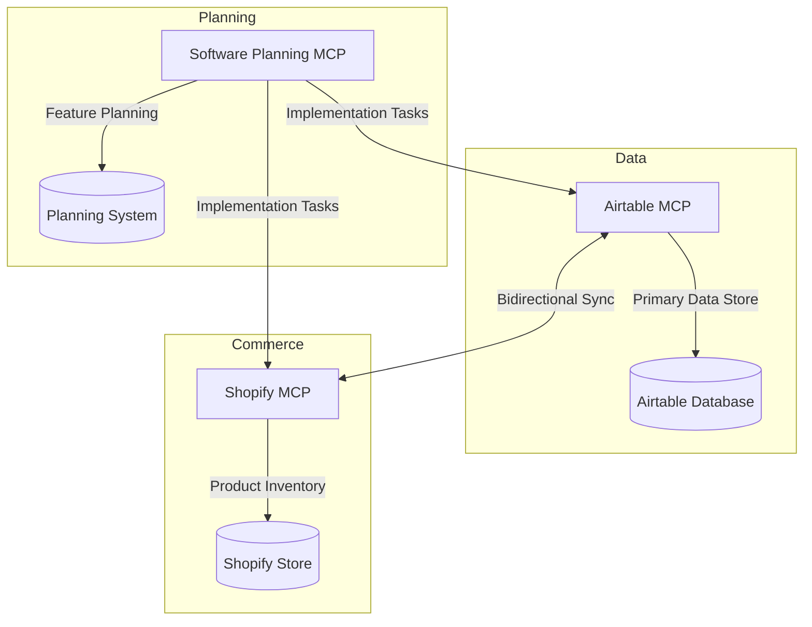
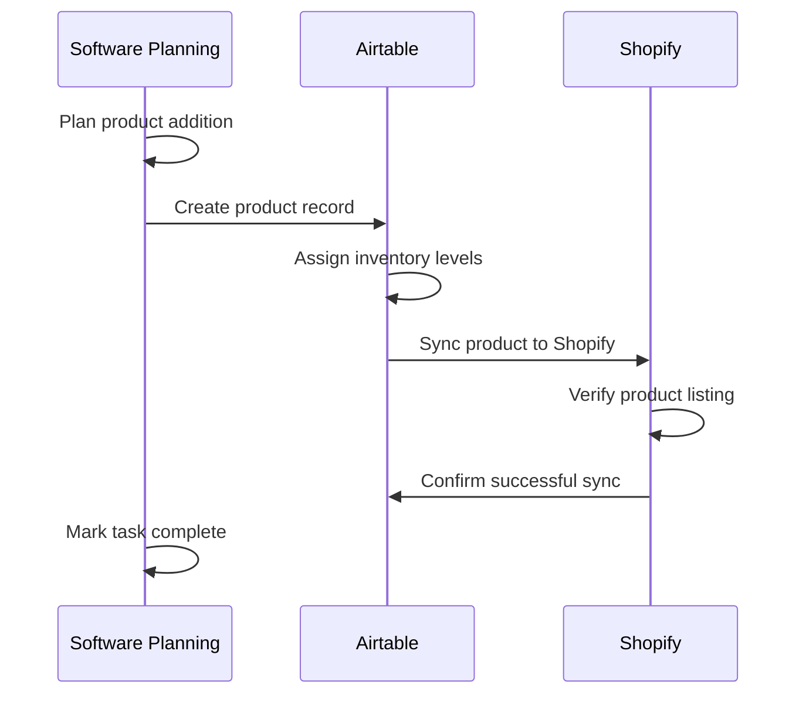
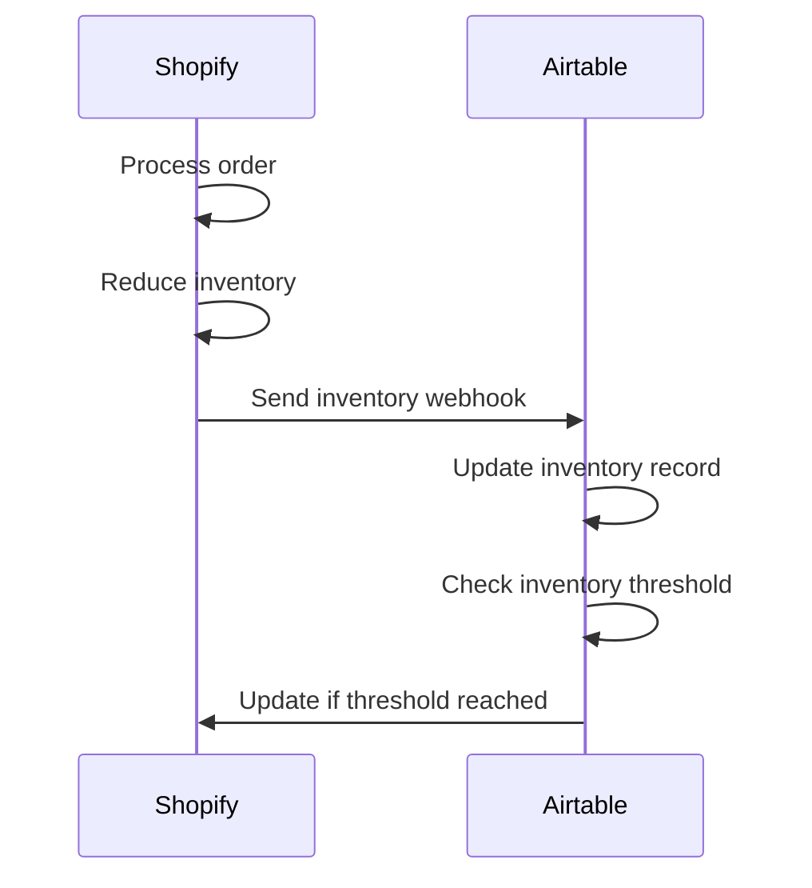
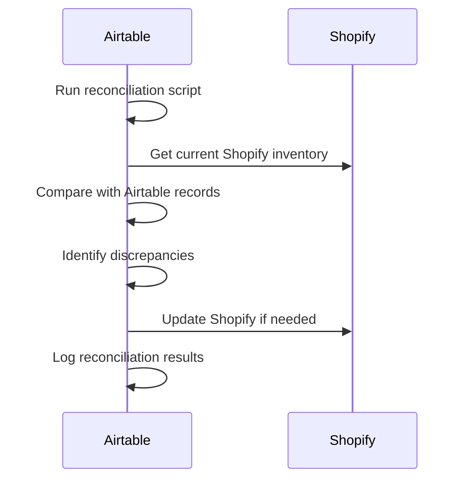

# MCP Inventory Management

This document outlines how to use MCP servers for inventory management in Different Not Less Apparel.

## Overview

Different Not Less Apparel uses a combination of MCP servers to manage inventory across multiple platforms:

1. **Airtable MCP**: Primary inventory database
2. **Shopify MCP**: E-commerce platform inventory
3. **Software Planning MCP**: Planning and tracking inventory features

This integrated approach ensures consistent inventory data across all systems while providing tools for planning and implementing inventory-related features.

## Inventory Management Architecture



## Inventory Data Flow

1. **Airtable as Source of Truth**:
   - All product data originates in Airtable
   - Detailed inventory attributes stored in Airtable
   - Historical inventory data maintained in Airtable

2. **Shopify for Commerce**:
   - Customer-facing inventory displayed in Shopify
   - Order processing reduces inventory in Shopify
   - Inventory thresholds managed in Shopify

3. **Synchronization Process**:
   - Airtable → Shopify: Product details, inventory levels, variants
   - Shopify → Airtable: Sales data, inventory adjustments, customer feedback

## MCP Tools for Inventory Management

### Airtable MCP Tools

```javascript
// Get inventory levels for a product
const inventory = await callTool("airtable-mcp-server", "list_records", {
  baseId: "appXXXXXXXXXXXXXX",
  tableId: "tblInventory",
  filterByFormula: `{ProductID} = '${productId}'`
});

// Update inventory level
await callTool("airtable-mcp-server", "update_records", {
  baseId: "appXXXXXXXXXXXXXX",
  tableId: "tblInventory",
  records: [{
    id: recordId,
    fields: {
      "QuantityAvailable": newQuantity
    }
  }]
});
```

### Shopify MCP Tools

```javascript
// Get product inventory from Shopify
const product = await callTool("shopify-mcp-server", "get-products-by-ids", {
  productIds: [shopifyProductId]
});

// Update product inventory in Shopify
await callTool("shopify-mcp-server", "update-product-inventory", {
  productId: shopifyProductId,
  variantId: variantId,
  inventory: newInventoryLevel
});
```

### Software Planning MCP Tools

```javascript
// Start planning inventory feature
await callTool("github.com/NightTrek/Software-planning-mcp", "start_planning", {
  goal: "Implement low inventory notification system"
});

// Add inventory feature task
await callTool("github.com/NightTrek/Software-planning-mcp", "add_todo", {
  title: "Create inventory threshold triggers",
  description: "Implement system to monitor inventory levels and trigger notifications when products fall below threshold",
  complexity: 6,
  codeExample: "// Example threshold monitoring\nfunction checkInventoryLevels() {\n  const lowInventoryItems = inventory.filter(item => item.quantity < item.threshold);\n  if (lowInventoryItems.length > 0) {\n    sendNotification(lowInventoryItems);\n  }\n}"
});
```

## Inventory Management Workflows

### 1. New Product Addition Workflow



**Implementation Steps:**
1. Use Software Planning to create tasks for new product
2. Add product data to Airtable using Airtable MCP
3. Set initial inventory levels in Airtable
4. Trigger sync to Shopify using webhook or manual sync
5. Verify product appears correctly in Shopify
6. Mark implementation tasks complete in Software Planning

### 2. Inventory Update Workflow



**Implementation Steps:**
1. Configure Shopify webhook for inventory changes
2. Create webhook handler to update Airtable
3. Implement threshold checking logic
4. Set up notification system for low inventory
5. Create restock workflow in Airtable

### 3. Inventory Reconciliation Workflow



**Implementation Steps:**
1. Create scheduled reconciliation task
2. Implement comparison logic between systems
3. Create audit log in Airtable
4. Set up notification for significant discrepancies

## Inventory Data Model

### Airtable Schema

| Table | Purpose | Key Fields |
|-------|---------|------------|
| Products | Core product data | ProductID, Title, Description, ProductType |
| Variants | Product variations | VariantID, ProductID, Size, Color, Material |
| Inventory | Stock levels | VariantID, QuantityAvailable, ReorderThreshold |
| InventoryHistory | Historical data | VariantID, Timestamp, QuantityChange, Reason |

### Shopify-Airtable Field Mapping

| Airtable Field | Shopify Field | Sync Direction |
|----------------|---------------|----------------|
| ProductID | id | Airtable ← Shopify |
| Title | title | Airtable → Shopify |
| Description | body_html | Airtable → Shopify |
| VariantID | variant.id | Airtable ← Shopify |
| QuantityAvailable | variant.inventory_quantity | Bidirectional |
| Price | variant.price | Airtable → Shopify |

## Best Practices

### 1. Inventory Accuracy

- Perform daily reconciliation between systems
- Implement validation rules in Airtable
- Use webhooks for real-time updates
- Log all inventory changes with reason codes

### 2. Low Inventory Management

- Set appropriate reorder thresholds for each product
- Configure automated notifications for low stock
- Implement "low stock" indicators on product pages
- Create prioritized reordering lists

### 3. Inventory Planning

- Use Software Planning MCP to plan inventory features
- Break down inventory projects into manageable tasks
- Track implementation progress
- Document inventory management decisions

## Troubleshooting

### Common Issues

1. **Sync Failures**
   - Check webhook configurations
   - Verify API credentials
   - Inspect error logs in both systems
   - Manually trigger sync to resolve

2. **Inventory Discrepancies**
   - Run reconciliation script
   - Check for failed webhooks
   - Verify no manual adjustments were made
   - Check for order processing errors

3. **Performance Issues**
   - Optimize webhook payloads
   - Implement batch processing for large updates
   - Schedule intensive operations during off-hours
   - Monitor API rate limits

## Related Documentation

- [Software Planning Workflows](./software-planning-workflows.md)
- [Airtable MCP Workflows](./airtable-mcp-workflows.md)
- [Shopify MCP Workflows](./shopify-mcp-workflows.md)
