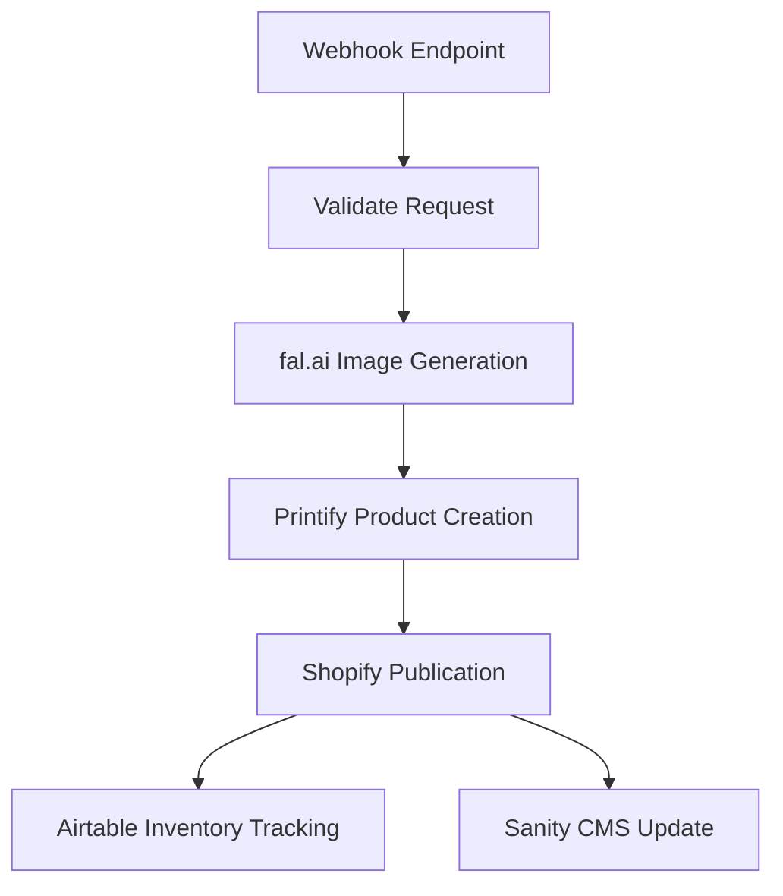
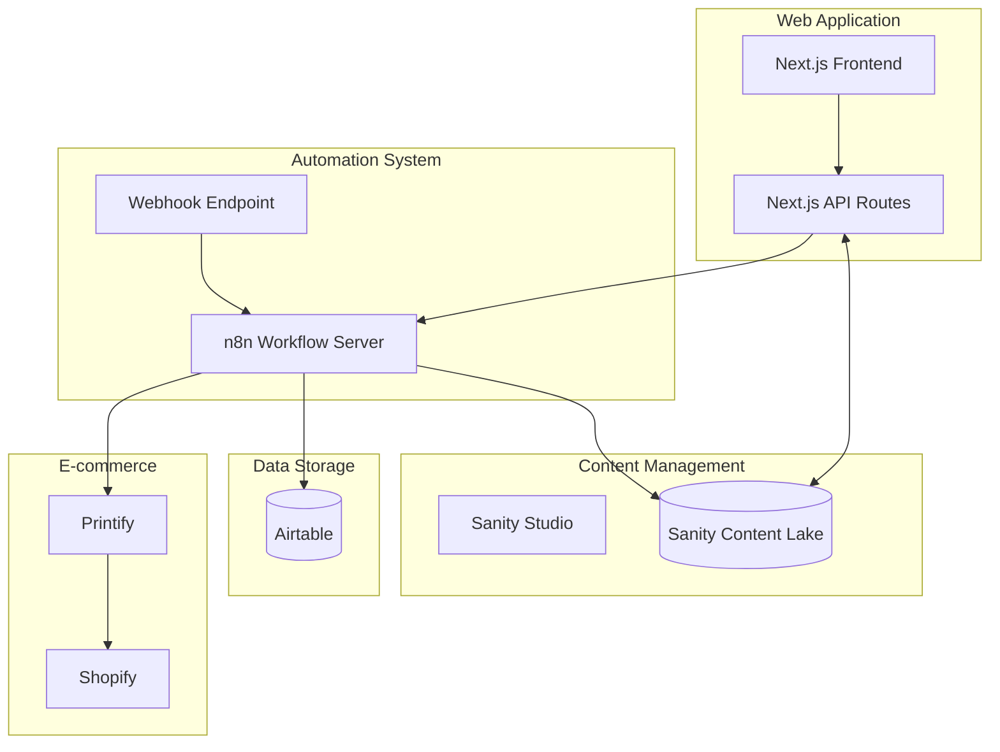

# n8n Automation Workflows

## Overview

The n8n automation system enables automated t-shirt design generation and product creation for Different Not Less Apparel. This document outlines workflows, integration points, and operational guidelines.

## Core Workflows

### 1. T-Shirt Design Generation Workflow



### 2. Integration Architecture



## Deployment Architecture

Our n8n server is deployed alongside our Next.js application and Sanity Studio using Docker Compose:

- **n8n container**: Hosts the workflow automation server
- **Next.js container**: Our main web application
- **Sanity Studio**: Content management interface

## Integration Points

### 1. Printify Integration

- Creates products with generated designs
- Supports all product types (t-shirts, hoodies, etc.)
- Maps variants with appropriate sizes and colors
- Sets pricing based on product type

### 2. Shopify Integration

- Publishes products via Printify
- Maintains product information consistency
- Links with Shopify MCP server for additional operations

### 3. Airtable Integration

- Updates inventory records
- Creates product tracking entries
- Maintains cross-platform ID references
- Links with Airtable MCP server for data synchronization

### 4. Sanity CMS Integration

- Creates product entries in the content management system
- Maintains relationships between products and collections
- Ensures content consistency across platforms

## API Configuration

### fal.ai Configuration

- **Model**: Image generation optimized for transparent t-shirt designs
- **Output Dimensions**: 4500x5400px
- **Format**: Transparent PNG

### Webhook Endpoint

- **URL**: https://difnotless.com/api/webhook/product-creation
- **Method**: POST
- **Authentication**: API key in header

## Usage Examples

### Example Request

```json
{
  "prompt": "Your Words Matter t-shirt with AAC device layout in blue and gold colors",
  "productType": "t-shirt",
  "title": "Your Words Matter - AAC Device",
  "description": "Celebrate all forms of communication with our signature AAC-inspired design.",
  "collections": ["Your Words Matter", "SLP Collection"],
  "tags": ["AAC", "speech therapy", "communication", "SLP"],
  "variants": [
    { "color": "white", "sizes": ["S", "M", "L", "XL", "2XL"] },
    { "color": "light blue", "sizes": ["S", "M", "L", "XL"] }
  ]
}
```

### Example Response

```json
{
  "success": true,
  "message": "Product successfully created and synced",
  "product": {
    "title": "Your Words Matter - AAC Device",
    "printifyProductId": "123456789",
    "printifyEditUrl": "https://printify.com/app/editor/123456789",
    "shopifyProductId": "987654321",
    "shopifyUrl": "https://differentnotless.com/products/your-words-matter-aac-device",
    "designImageUrl": "https://cdn.fal.ai/outputs/123456.png",
    "sanityProductId": "product-123456"
  }
}
```

## Operational Guidelines

### Security Considerations

- API keys stored as environment variables
- Webhook endpoint secured with authentication
- n8n admin interface password protected
- Network isolation between services

### Monitoring and Maintenance

- Daily health checks for n8n workflows
- Monitoring of webhook response times
- Regular workflow backups
- Error notification system via Slack

### Scaling Considerations

- Horizontal scaling for increased load
- Rate limiting for external APIs
- Caching for repeated operations
- Queue management for high-volume periods

## Blueprint IDs Reference

For use with Printify API integration:

- T-shirts (blueprint_id: 5)
- Hoodies (blueprint_id: 9)
- Sweatshirts (blueprint_id: 14)
- Long Sleeve Shirts (blueprint_id: 7)
- Tank Tops (blueprint_id: 13)

## Workflow Implementation Details

### 1. Webhook Validation Node

```javascript
// Input validation function
function validateInput(input) {
  const requiredFields = ['prompt', 'productType', 'title'];
  const missingFields = requiredFields.filter(field => !input[field]);
  
  if (missingFields.length > 0) {
    return {
      valid: false,
      error: `Missing required fields: ${missingFields.join(', ')}`
    };
  }
  
  // Set defaults for optional fields
  if (!input.description) {
    input.description = `${input.title} - Different Not Less Apparel`;
  }
  
  if (!input.collections) {
    input.collections = [];
  }
  
  if (!input.tags) {
    input.tags = ['Different Not Less', 'AAC', 'autism acceptance'];
  }
  
  if (!input.variants) {
    input.variants = [
      { color: 'white', sizes: ['S', 'M', 'L', 'XL', '2XL'] }
    ];
  }
  
  return {
    valid: true,
    input: input
  };
}
```

### 2. fal.ai Image Generation Node

```javascript
// Example fal.ai API configuration
{
  "url": "https://api.fal.ai/v1/image-generation",
  "method": "POST",
  "headers": {
    "Authorization": "Bearer {{$env.FALAI_API_KEY}}",
    "Content-Type": "application/json"
  },
  "body": {
    "prompt": "{{$node[\"Webhook\"].json[\"prompt\"]}}",
    "negative_prompt": "low quality, distorted text, blurry, pixelated",
    "width": 4500,
    "height": 5400,
    "num_images": 1,
    "model": "stable-diffusion-xl-1024-v1-0",
    "output_format": "png",
    "transparent": true
  }
}
```

### 3. Printify Product Creation Node

```javascript
// Example Printify API configuration
{
  "url": "https://api.printify.com/v1/shops/{{$env.PRINTIFY_SHOP_ID}}/products.json",
  "method": "POST",
  "headers": {
    "Authorization": "Bearer {{$env.PRINTIFY_API_KEY}}",
    "Content-Type": "application/json"
  },
  "body": {
    "title": "{{$node[\"Webhook\"].json[\"title\"]}}",
    "description": "{{$node[\"Webhook\"].json[\"description\"]}}",
    "blueprint_id": {{getBlueprintId($node["Webhook"].json["productType"])}},
    "print_provider_id": 29,
    "variants": {{generateVariants($node["Webhook"].json["variants"])}},
    "print_areas": [
      {
        "position": "front",
        "images": [
          {
            "id": "{{$node[\"Image Upload\"].json[\"id\"]}}",
            "x": 0.5,
            "y": 0.5,
            "scale": 0.9,
            "angle": 0
          }
        ]
      }
    ],
    "tags": "{{$node[\"Webhook\"].json[\"tags\"]}}",
    "options": {
      "is_locked": false
    }
  }
}
```

### 4. Airtable Update Node

```javascript
// Example Airtable API configuration
{
  "operation": "Create Record",
  "application": "{{$env.AIRTABLE_BASE_ID}}",
  "table": "Products",
  "options": {
    "title": "{{$node[\"Webhook\"].json[\"title\"]}}",
    "description": "{{$node[\"Webhook\"].json[\"description\"]}}",
    "productType": "{{$node[\"Webhook\"].json[\"productType\"]}}",
    "printifyProductId": "{{$node[\"Printify\"].json[\"id\"]}}",
    "shopifyProductId": "{{$node[\"Printify\"].json[\"shopify_id\"]}}",
    "designImageUrl": "{{$node[\"fal.ai\"].json[\"output\"][0][\"url\"]}}",
    "collections": "{{$node[\"Webhook\"].json[\"collections\"]}}",
    "tags": "{{$node[\"Webhook\"].json[\"tags\"]}}",
    "status": "Active"
  }
}
```

### 5. Sanity CMS Update Node

```javascript
// Example Sanity API configuration
{
  "operation": "Create Document",
  "documentType": "product",
  "document": {
    "title": "{{$node[\"Webhook\"].json[\"title\"]}}",
    "slug": {
      "_type": "slug",
      "current": "{{slugify($node[\"Webhook\"].json[\"title\"])}}"
    },
    "shopifyProductId": "{{$node[\"Printify\"].json[\"shopify_id\"]}}",
    "airtableRecordId": "{{$node[\"Airtable\"].json[\"id\"]}}",
    "mainImage": {
      "_type": "image",
      "asset": {
        "_type": "reference",
        "_ref": "{{$node[\"Sanity Upload\"].json[\"assetId\"]}}"
      }
    },
    "description": [
      {
        "_type": "block",
        "style": "normal",
        "children": [
          {
            "_type": "span",
            "text": "{{$node[\"Webhook\"].json[\"description\"]}}"
          }
        ]
      }
    ],
    "seoKeywords": "{{$node[\"Webhook\"].json[\"tags\"]}}"
  }
}
```

## Error Handling Strategy

1. **Validation Errors**: Return immediate response with error details
2. **API Failures**: Implement retry logic with exponential backoff
3. **Partial Success**: Continue workflow and log issues for manual review
4. **Critical Failures**: Send notification to Slack channel and create GitHub issue

## Backup and Recovery

1. **Regular Exports**: Daily export of all workflows
2. **Version Control**: Store workflow JSON files in Git repository
3. **Credential Backup**: Encrypted backup of all credentials
4. **Disaster Recovery**: Documented procedure for complete system restoration
