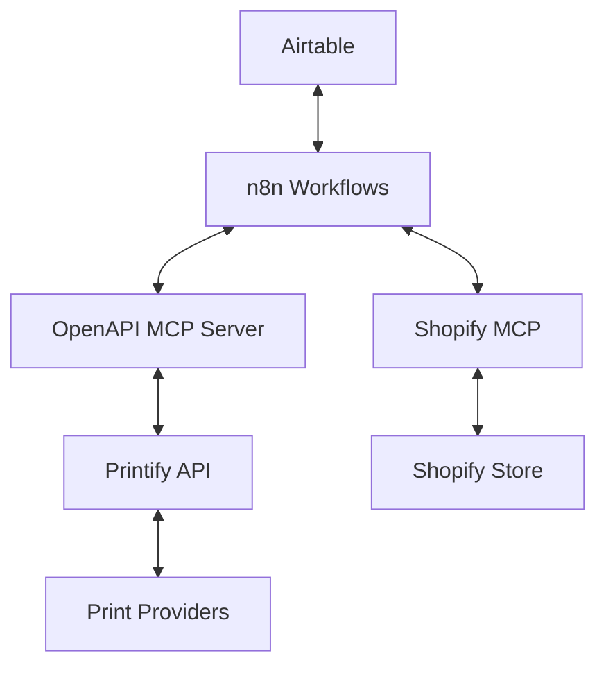
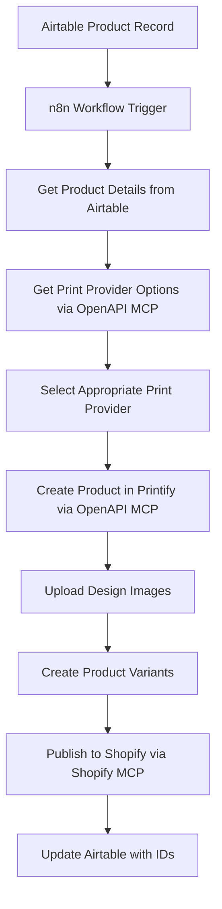
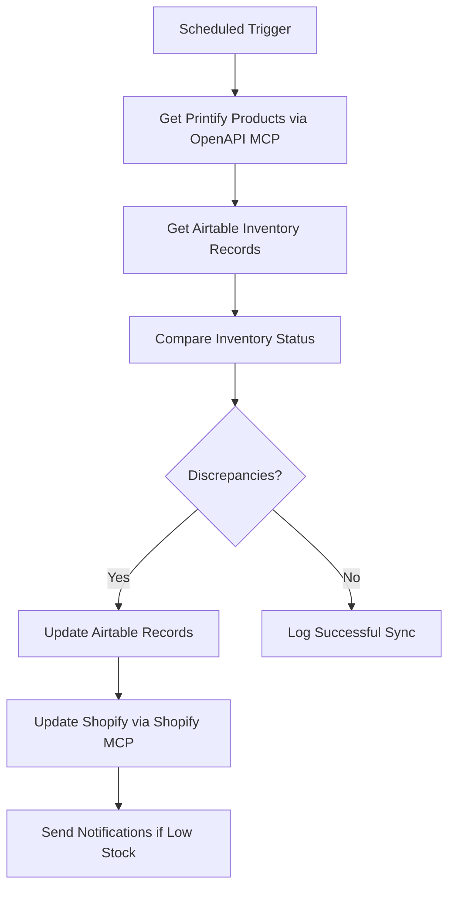
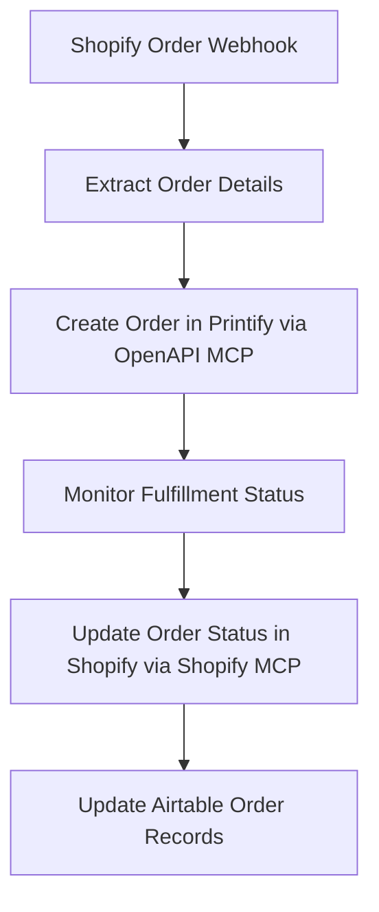

# Printify OpenAPI MCP Integration Workflows

## Overview

This document outlines the planned workflows for the Printify OpenAPI MCP integration, scheduled for implementation after launch (April 30-May 14, 2025). The integration will leverage the OpenAPI MCP server to provide standardized access to Printify's API services.

## Integration Architecture

The Printify OpenAPI MCP integration will connect our existing systems with Printify's API services through a standardized OpenAPI interface:

## Key Workflows

### 1. Product Creation Workflow

This workflow will automate the creation of new products in Printify based on data from Airtable:

**Implementation Details:**
- Use the OpenAPI MCP server to standardize Printify API calls
- Implement error handling and retry logic
- Add validation for product data before submission
- Create detailed logging for troubleshooting

### 2. Inventory Sync Workflow

This workflow will keep inventory levels synchronized between Printify, Shopify, and Airtable:

**Implementation Details:**
- Schedule regular inventory checks (hourly during business hours)
- Implement threshold-based alerts for low inventory
- Create reconciliation reports for manual review
- Add performance monitoring for sync operations

### 3. Order Processing Workflow

This workflow will handle order creation and fulfillment tracking:

**Implementation Details:**
- Implement webhook handlers for real-time order processing
- Add status polling as a fallback mechanism
- Create customer notification triggers for status updates
- Implement error handling for failed order submissions

## Implementation Plan

### Phase 1: Setup and Configuration (2 days)

1. Install and configure the OpenAPI MCP server
2. Set up authentication with Printify API
3. Test basic connectivity and operations
4. Create environment configuration

### Phase 2: Core Workflows Implementation (5 days)

1. Implement Product Creation workflow
2. Develop Inventory Sync workflow
3. Create Order Processing workflow
4. Build error handling and retry logic
5. Implement logging and monitoring

### Phase 3: Testing and Optimization (3 days)

1. Perform end-to-end testing of all workflows
2. Optimize performance for high-volume operations
3. Refine error handling and recovery procedures
4. Implement monitoring and alerting

### Phase 4: Documentation and Training (2 days)

1. Complete technical documentation
2. Create user guides for operations team
3. Conduct training sessions for relevant team members
4. Develop troubleshooting guides

### Phase 5: Deployment and Monitoring (2 days)

1. Deploy to staging environment
2. Perform validation testing
3. Deploy to production
4. Establish monitoring and support procedures

## Integration Touchpoints

### Airtable Integration

The Printify OpenAPI MCP will interact with Airtable for:

1. Product data retrieval
2. Inventory updates
3. Order tracking
4. Design asset management

### Shopify Integration

The integration will connect with Shopify MCP for:

1. Product publishing
2. Order synchronization
3. Inventory management
4. Pricing updates

### n8n Workflow Integration

n8n will orchestrate the workflows between systems:

1. Trigger workflows based on events
2. Process data transformations
3. Handle error conditions and retries
4. Schedule recurring tasks

## API Endpoints

The OpenAPI MCP server will expose the following key endpoints:

1. **Product Management**
   - `GET /shops/{shop_id}/products` - List all products
   - `POST /shops/{shop_id}/products` - Create a product
   - `GET /shops/{shop_id}/products/{product_id}` - Get product details
   - `PUT /shops/{shop_id}/products/{product_id}` - Update a product
   - `DELETE /shops/{shop_id}/products/{product_id}` - Delete a product

2. **Print Provider Management**
   - `GET /print_providers` - List all print providers
   - `GET /print_providers/{provider_id}` - Get provider details
   - `GET /print_providers/{provider_id}/blueprints` - Get provider blueprints

3. **Order Management**
   - `GET /shops/{shop_id}/orders` - List all orders
   - `POST /shops/{shop_id}/orders` - Create an order
   - `GET /shops/{shop_id}/orders/{order_id}` - Get order details
   - `PUT /shops/{shop_id}/orders/{order_id}` - Update an order

4. **Publishing**
   - `POST /shops/{shop_id}/products/{product_id}/publish` - Publish a product

## Error Handling Strategy

The integration will implement a comprehensive error handling strategy:

1. **Retry Logic**
   - Implement exponential backoff for transient errors
   - Set maximum retry attempts based on error type
   - Log all retry attempts for monitoring

2. **Error Categorization**
   - API errors (rate limits, authentication, etc.)
   - Data validation errors
   - Network connectivity issues
   - System errors

3. **Fallback Mechanisms**
   - Manual intervention triggers for critical failures
   - Alternate processing paths for specific error conditions
   - Queuing system for delayed processing

4. **Monitoring and Alerting**
   - Real-time error notifications for critical issues
   - Error rate monitoring and thresholds
   - Periodic error summary reports

## Security Considerations

The integration will implement the following security measures:

1. **Authentication**
   - Secure storage of API credentials
   - Token rotation and management
   - Access control for MCP server endpoints

2. **Data Protection**
   - Encryption of sensitive data in transit
   - Minimal data retention policies
   - Secure handling of customer information

3. **Audit Logging**
   - Comprehensive logging of all API operations
   - Access logs for security monitoring
   - Change tracking for configuration updates

## Performance Optimization

To ensure optimal performance, the integration will implement:

1. **Request Batching**
   - Combine multiple operations where possible
   - Implement bulk processing for inventory updates
   - Optimize API call frequency

2. **Caching Strategy**
   - Cache print provider and blueprint data
   - Implement TTL-based cache invalidation
   - Use memory-efficient caching mechanisms

3. **Resource Management**
   - Monitor and limit concurrent API calls
   - Implement resource pools for connection management
   - Optimize memory usage for large payloads

## Monitoring and Maintenance

The integration will include comprehensive monitoring:

1. **Operational Metrics**
   - API call volume and response times
   - Error rates and types
   - Workflow execution times
   - Resource utilization

2. **Business Metrics**
   - Product creation success rates
   - Order fulfillment times
   - Inventory accuracy
   - Synchronization latency

3. **Maintenance Procedures**
   - Regular health checks
   - Scheduled maintenance windows
   - Version update procedures
   - Backup and recovery processes

## Conclusion

The Printify OpenAPI MCP integration will provide a robust, standardized interface to Printify's API services, enabling automated product creation, inventory management, and order processing. By leveraging the OpenAPI MCP server, we ensure maintainability, scalability, and consistent error handling across all Printify operations.

Implementation is scheduled to begin on April 30, 2025, with a target completion date of May 14, 2025.
