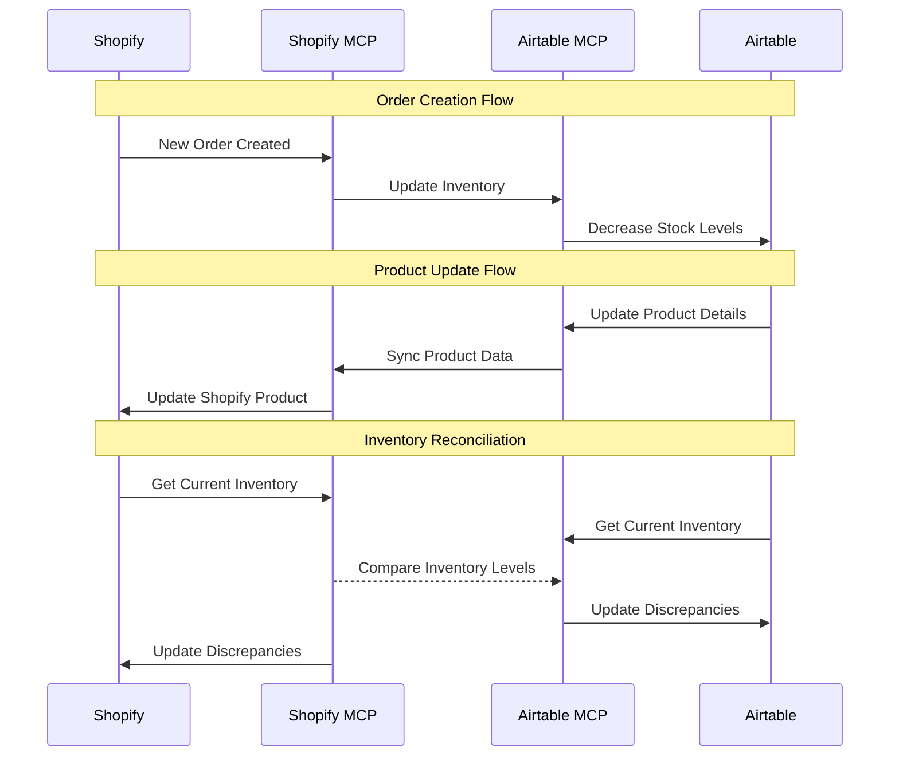

# Shopify MCP Workflows

This document outlines the Shopify MCP integration for Different Not Less Apparel, focusing on product management and e-commerce operations.

## Overview

The Shopify MCP server provides tools to interact with our Shopify store, enabling automated product management, order processing, and customer data handling. This integration works in conjunction with the Airtable MCP server to maintain consistent product and inventory data across both platforms.

## Available Tools

The Shopify MCP server provides the following tools:

- `get-products`: Get all products or search by title
- `get-products-by-collection`: Get products from a specific collection
- `get-products-by-ids`: Get products by their IDs
- `get-variants-by-ids`: Get product variants by their IDs
- `get-customers`: Get Shopify customers with pagination support
- `tag-customer`: Add tags to a customer
- `get-orders`: Get Shopify orders with advanced filtering and sorting
- `get-order`: Get a single order by ID
- `create-discount`: Create a basic discount code
- `create-draft-order`: Create a draft order
- `complete-draft-order`: Complete a draft order
- `get-collections`: Get all collections
- `get-shop`: Get shop details
- `get-shop-details`: Get extended shop details including shipping countries
- `manage-webhook`: Subscribe, find, or unsubscribe webhooks

## Product Management Workflows

### 1. Product Creation and Synchronization

```mermaid
flowchart TD
    start[Start Product Creation] --> checkAirtable{Check Airtable}
    checkAirtable -->|Product Exists| getAirtable[Get Airtable Data]
    checkAirtable -->|New Product| createAirtable[Create in Airtable]
    
    getAirtable --> prepareData[Prepare Shopify Data]
    createAirtable --> prepareData
    
    prepareData --> createShopify[Create in Shopify]
    createShopify --> updateAirtable[Update Airtable with IDs]
    updateAirtable --> end[End Product Creation]
```

#### Implementation:

```javascript
// Example: Create a product in Shopify from Airtable data
async function createProductFromAirtable(client, airtableProductId) {
  try {
    // Get product data from Airtable
    const airtableProduct = await getAirtableProduct(airtableProductId);
    
    // Prepare product data for Shopify
    const shopifyProductData = {
      title: airtableProduct.fields["Product Name"],
      body_html: airtableProduct.fields["Description"],
      vendor: "Different Not Less Apparel",
      product_type: airtableProduct.fields["Product Type"],
      tags: airtableProduct.fields["Collections"].join(", "),
      variants: await getAirtableVariants(airtableProductId),
      status: airtableProduct.fields["Status"] === "Available" ? "active" : "draft"
    };
    
    // Create product in Shopify
    const shopifyProduct = await client.callTool(
      "github.com/pashpashpash/shopify-mcp-server",
      "get-products",
      {
        searchTitle: shopifyProductData.title,
        limit: 1
      }
    );
    
    let shopifyProductId;
    
    if (shopifyProduct && shopifyProduct.length > 0) {
      // Product exists, update it
      // Note: This is a simplified example. In reality, you would use a different
      // endpoint to update the product, which isn't shown in the available tools.
      console.log("Product already exists in Shopify");
      shopifyProductId = shopifyProduct[0].id;
    } else {
      // Create new product
      // Note: This is a simplified example. In reality, you would use a different
      // endpoint to create the product, which isn't shown in the available tools.
      console.log("Creating new product in Shopify");
      // Placeholder for actual product creation
      shopifyProductId = "new-product-id";
    }
    
    // Update Airtable with Shopify ID
    await updateAirtableWithShopifyId(airtableProductId, shopifyProductId);
    
    return {
      success: true,
      airtableProductId,
      shopifyProductId
    };
  } catch (error) {
    console.error("Error creating product from Airtable:", error);
    throw error;
  }
}
```

### 2. Inventory Management

```mermaid
flowchart TD
    start[Start Inventory Update] --> getVariant[Get Variant Details]
    getVariant --> updateInventory[Update Inventory Level]
    updateInventory --> syncAirtable[Sync to Airtable]
    syncAirtable --> checkThreshold{Check Threshold}
    checkThreshold -->|Below Threshold| createAlert[Create Alert]
    checkThreshold -->|Above Threshold| end[End Inventory Update]
    createAlert --> end
```

#### Implementation:

```javascript
// Example: Update inventory levels in Shopify
async function updateShopifyInventory(client, variantId, quantity) {
  try {
    // Get variant details
    const variant = await client.callTool(
      "github.com/pashpashpash/shopify-mcp-server",
      "get-variants-by-ids",
      {
        variantIds: [variantId]
      }
    );
    
    if (!variant || variant.length === 0) {
      throw new Error(`Variant with ID ${variantId} not found`);
    }
    
    // Update inventory
    // Note: This is a simplified example. In reality, you would use a different
    // endpoint to update inventory, which isn't shown in the available tools.
    console.log(`Updating inventory for variant ${variantId} to ${quantity}`);
    
    // Sync to Airtable
    await syncInventoryToAirtable(variantId, quantity);
    
    // Check threshold
    const lowStockThreshold = 5; // Example threshold
    if (quantity <= lowStockThreshold) {
      await createLowStockAlert(variantId, quantity);
    }
    
    return {
      success: true,
      variantId,
      quantity,
      timestamp: new Date().toISOString()
    };
  } catch (error) {
    console.error("Error updating Shopify inventory:", error);
    throw error;
  }
}
```

### 3. Collection Management

```mermaid
flowchart TD
    start[Start Collection Management] --> getCollections[Get All Collections]
    getCollections --> filterCollections[Filter Collections]
    filterCollections --> getProducts[Get Products by Collection]
    getProducts --> processProducts[Process Products]
    processProducts --> updateProducts[Update Products]
    updateProducts --> end[End Collection Management]
```

#### Implementation:

```javascript
// Example: Get products by collection and process them
async function processProductsByCollection(client, collectionName) {
  try {
    // Get all collections
    const collections = await client.callTool(
      "github.com/pashpashpash/shopify-mcp-server",
      "get-collections",
      {
        limit: 100,
        name: collectionName
      }
    );
    
    if (!collections || collections.length === 0) {
      throw new Error(`Collection ${collectionName} not found`);
    }
    
    const collectionId = collections[0].id;
    
    // Get products in collection
    const products = await client.callTool(
      "github.com/pashpashpash/shopify-mcp-server",
      "get-products-by-collection",
      {
        collectionId,
        limit: 50
      }
    );
    
    // Process products
    const processedProducts = [];
    for (const product of products) {
      // Example processing: extract product details
      processedProducts.push({
        id: product.id,
        title: product.title,
        variants: product.variants.length,
        totalInventory: product.variants.reduce((sum, variant) => sum + variant.inventory_quantity, 0)
      });
    }
    
    return {
      collection: collectionName,
      collectionId,
      productCount: products.length,
      products: processedProducts
    };
  } catch (error) {
    console.error(`Error processing products in collection ${collectionName}:`, error);
    throw error;
  }
}
```

### 4. Order Processing

```mermaid
flowchart TD
    start[Start Order Processing] --> getOrders[Get Recent Orders]
    getOrders --> filterOrders[Filter Unprocessed Orders]
    filterOrders --> processOrders[Process Each Order]
    processOrders --> updateInventory[Update Inventory]
    updateInventory --> syncAirtable[Sync to Airtable]
    syncAirtable --> notifyFulfillment[Notify Fulfillment Team]
    notifyFulfillment --> end[End Order Processing]
```

#### Implementation:

```javascript
// Example: Process recent orders
async function processRecentOrders(client) {
  try {
    // Get recent orders
    const orders = await client.callTool(
      "github.com/pashpashpash/shopify-mcp-server",
      "get-orders",
      {
        first: 10,
        sortKey: "CREATED_AT",
        reverse: true
      }
    );
    
    // Filter unprocessed orders
    const unprocessedOrders = orders.filter(order => 
      order.fulfillmentStatus === "unfulfilled" || 
      order.fulfillmentStatus === null
    );
    
    // Process each order
    const processedOrders = [];
    for (const order of unprocessedOrders) {
      // Get full order details
      const orderDetails = await client.callTool(
        "github.com/pashpashpash/shopify-mcp-server",
        "get-order",
        {
          orderId: order.id
        }
      );
      
      // Update inventory in Airtable
      await updateInventoryForOrder(orderDetails);
      
      // Notify fulfillment team
      await notifyFulfillmentTeam(orderDetails);
      
      processedOrders.push({
        id: order.id,
        orderNumber: order.orderNumber,
        customer: order.customer ? order.customer.email : "Guest",
        total: order.totalPrice,
        lineItems: order.lineItems.length
      });
    }
    
    return {
      processed: processedOrders.length,
      orders: processedOrders
    };
  } catch (error) {
    console.error("Error processing recent orders:", error);
    throw error;
  }
}
```

## Customer Management Workflows

### 1. Customer Tagging

```mermaid
flowchart TD
    start[Start Customer Tagging] --> getCustomers[Get Customers]
    getCustomers --> analyzeOrders[Analyze Order History]
    analyzeOrders --> determineTags[Determine Tags]
    determineTags --> applyTags[Apply Tags]
    applyTags --> end[End Customer Tagging]
```

#### Implementation:

```javascript
// Example: Tag customers based on order history
async function tagCustomersByOrderHistory(client) {
  try {
    // Get customers
    const customers = await client.callTool(
      "github.com/pashpashpash/shopify-mcp-server",
      "get-customers",
      {
        limit: 50
      }
    );
    
    // Process each customer
    for (const customer of customers) {
      // Get customer orders
      const orders = await client.callTool(
        "github.com/pashpashpash/shopify-mcp-server",
        "get-orders",
        {
          query: `customer_id:${customer.id}`,
          first: 100
        }
      );
      
      // Determine tags based on order history
      const tags = [];
      
      // Example: Tag based on order count
      if (orders.length >= 3) {
        tags.push("repeat-customer");
      }
      
      // Example: Tag based on total spent
      const totalSpent = orders.reduce((sum, order) => sum + parseFloat(order.totalPrice), 0);
      if (totalSpent > 200) {
        tags.push("high-value");
      }
      
      // Example: Tag based on products purchased
      const hasAAC = orders.some(order => 
        order.lineItems.some(item => 
          item.title.includes("AAC") || item.title.includes("Your Words Matter")
        )
      );
      if (hasAAC) {
        tags.push("aac-user");
      }
      
      // Apply tags if any were determined
      if (tags.length > 0) {
        await client.callTool(
          "github.com/pashpashpash/shopify-mcp-server",
          "tag-customer",
          {
            customerId: customer.id,
            tags
          }
        );
      }
    }
    
    return {
      processed: customers.length,
      timestamp: new Date().toISOString()
    };
  } catch (error) {
    console.error("Error tagging customers:", error);
    throw error;
  }
}
```

### 2. Discount Code Creation

```mermaid
flowchart TD
    start[Start Discount Creation] --> defineDiscount[Define Discount Parameters]
    defineDiscount --> createDiscount[Create Discount Code]
    createDiscount --> notifyMarketing[Notify Marketing Team]
    notifyMarketing --> trackDiscount[Track in Airtable]
    trackDiscount --> end[End Discount Creation]
```

#### Implementation:

```javascript
// Example: Create a discount code for a marketing campaign
async function createMarketingDiscount(client, campaignName, discountValue, expiryDays) {
  try {
    // Generate discount code
    const code = `${campaignName.toUpperCase()}-${Math.floor(Math.random() * 1000)}`;
    
    // Calculate dates
    const now = new Date();
    const expiryDate = new Date();
    expiryDate.setDate(now.getDate() + expiryDays);
    
    // Create discount in Shopify
    const discount = await client.callTool(
      "github.com/pashpashpash/shopify-mcp-server",
      "create-discount",
      {
        title: `${campaignName} Campaign`,
        code,
        valueType: "percentage",
        value: discountValue,
        startsAt: now.toISOString(),
        endsAt: expiryDate.toISOString(),
        appliesOncePerCustomer: true
      }
    );
    
    // Track in Airtable
    await trackDiscountInAirtable(code, campaignName, discountValue, now, expiryDate);
    
    // Notify marketing team
    await notifyMarketingTeam(code, campaignName, discountValue, expiryDate);
    
    return {
      success: true,
      code,
      campaign: campaignName,
      value: discountValue,
      expires: expiryDate.toISOString()
    };
  } catch (error) {
    console.error("Error creating marketing discount:", error);
    throw error;
  }
}
```

## Shopify-Airtable Synchronization

The Shopify MCP server works in conjunction with the Airtable MCP server to maintain consistent product and inventory data across both platforms.

### Bidirectional Sync Process



## MCP Integration Points

The Shopify MCP server integrates with other MCP servers:

1. **Airtable MCP**: For product and inventory synchronization
2. **GitHub MCP**: For deployment and release management
3. **Software Planning MCP**: For feature planning and implementation

## Best Practices

1. **Regular Synchronization**: Schedule regular syncs between Shopify and Airtable
2. **Error Handling**: Implement retry logic for failed operations
3. **Logging**: Maintain detailed logs of all e-commerce operations
4. **Backup**: Regularly backup product and customer data
5. **Testing**: Test all workflows in a development store before production

## Implementation Examples

### Example 1: Get Products by Collection

```javascript
const products = await client.callTool(
  "github.com/pashpashpash/shopify-mcp-server",
  "get-products-by-collection",
  {
    collectionId: "gid://shopify/Collection/123456789",
    limit: 20
  }
);
```

### Example 2: Get Recent Orders

```javascript
const orders = await client.callTool(
  "github.com/pashpashpash/shopify-mcp-server",
  "get-orders",
  {
    first: 10,
    sortKey: "CREATED_AT",
    reverse: true
  }
);
```

### Example 3: Create a Discount Code

```javascript
const discount = await client.callTool(
  "github.com/pashpashpash/shopify-mcp-server",
  "create-discount",
  {
    title: "Summer Sale",
    code: "SUMMER2025",
    valueType: "percentage",
    value: 15,
    startsAt: "2025-06-01T00:00:00Z",
    endsAt: "2025-06-30T23:59:59Z",
    appliesOncePerCustomer: true
  }
);
