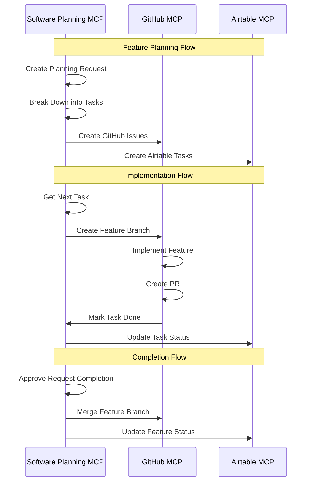

# Software Planning MCP Workflows

This document outlines the Software Planning MCP integration for Different Not Less Apparel, focusing on sprint planning and feature development.

## Overview

The Software Planning MCP server provides tools to facilitate sprint planning, task management, and feature development tracking. This integration helps organize development efforts, break down complex features into manageable tasks, and track implementation progress.

## Available Tools

The Software Planning MCP server provides the following tools:

- `start_planning`: Register a new user request and plan its associated tasks
- `get_next_task`: Get the next pending task for a request
- `mark_task_done`: Mark a task as completed
- `approve_task_completion`: Approve a completed task
- `approve_request_completion`: Approve the completion of an entire request
- `open_task_details`: Get details of a specific task
- `list_requests`: List all requests
- `add_tasks_to_request`: Add new tasks to an existing request
- `update_task`: Update an existing task
- `delete_task`: Delete a task from a request

## Sprint Planning Workflows

### 1. Feature Planning Process

```mermaid
flowchart TD
    start[Start Planning] --> createRequest[Create Planning Request]
    createRequest --> breakdownTasks[Break Down into Tasks]
    breakdownTasks --> assignComplexity[Assign Complexity Scores]
    assignComplexity --> prioritizeTasks[Prioritize Tasks]
    prioritizeTasks --> createSprint[Create Sprint Plan]
    createSprint --> end[End Planning]
```

#### Implementation:

```javascript
// Example: Plan a new feature
async function planNewFeature(client, featureInfo) {
  try {
    // Start planning session
    const planningSession = await client.callTool(
      "github.com/NightTrek/Software-planning-mcp",
      "start_planning",
      {
        originalRequest: `Implement ${featureInfo.featureName}`,
        splitDetails: featureInfo.description,
        tasks: [
          {
            title: "Research and Requirements",
            description: "Research existing solutions and gather requirements for the feature."
          },
          {
            title: "Design and Architecture",
            description: "Create design documents and plan the architecture for the feature."
          },
          {
            title: "Implementation",
            description: `Implement the ${featureInfo.featureName} feature according to the design.`
          },
          {
            title: "Testing",
            description: "Write and execute tests for the feature."
          },
          {
            title: "Documentation",
            description: "Document the feature and update relevant documentation."
          },
          {
            title: "Code Review",
            description: "Submit the code for review and address feedback."
          }
        ]
      }
    );
    
    return {
      success: true,
      requestId: planningSession.requestId,
      taskCount: planningSession.tasks.length
    };
  } catch (error) {
    console.error("Error planning new feature:", error);
    throw error;
  }
}
```

### 2. Task Management Process

```mermaid
flowchart TD
    start[Start Task Management] --> getNextTask[Get Next Task]
    getNextTask --> workOnTask[Work on Task]
    workOnTask --> markDone[Mark Task Done]
    markDone --> approveTask[Approve Task]
    approveTask --> checkMoreTasks{More Tasks?}
    checkMoreTasks -->|Yes| getNextTask
    checkMoreTasks -->|No| approveRequest[Approve Request]
    approveRequest --> end[End Task Management]
```

#### Implementation:

```javascript
// Example: Process tasks in a request
async function processTasksInRequest(client, requestId) {
  try {
    let allTasksComplete = false;
    
    while (!allTasksComplete) {
      // Get the next task
      const nextTask = await client.callTool(
        "github.com/NightTrek/Software-planning-mcp",
        "get_next_task",
        {
          requestId
        }
      );
      
      if (nextTask.status === "all_tasks_done") {
        allTasksComplete = true;
        
        // Approve the request completion
        await client.callTool(
          "github.com/NightTrek/Software-planning-mcp",
          "approve_request_completion",
          {
            requestId
          }
        );
        
        break;
      }
      
      // Work on the task (this would be the actual implementation)
      console.log(`Working on task: ${nextTask.title}`);
      
      // Mark the task as done
      await client.callTool(
        "github.com/NightTrek/Software-planning-mcp",
        "mark_task_done",
        {
          requestId,
          taskId: nextTask.taskId,
          completedDetails: "Task completed successfully."
        }
      );
      
      // Approve the task completion
      await client.callTool(
        "github.com/NightTrek/Software-planning-mcp",
        "approve_task_completion",
        {
          requestId,
          taskId: nextTask.taskId
        }
      );
    }
    
    return {
      success: true,
      requestId,
      status: "completed"
    };
  } catch (error) {
    console.error("Error processing tasks:", error);
    throw error;
  }
}
```

### 3. Sprint Planning

```mermaid
flowchart TD
    start[Start Sprint Planning] --> listRequests[List All Requests]
    listRequests --> prioritizeRequests[Prioritize Requests]
    prioritizeRequests --> estimateEffort[Estimate Effort]
    estimateEffort --> assignToSprint[Assign to Sprint]
    assignToSprint --> trackProgress[Track Progress]
    trackProgress --> end[End Sprint Planning]
```

#### Implementation:

```javascript
// Example: Plan a sprint
async function planSprint(client, sprintInfo) {
  try {
    // List all requests
    const requests = await client.callTool(
      "github.com/NightTrek/Software-planning-mcp",
      "list_requests",
      {}
    );
    
    // Filter and prioritize requests for the sprint
    const sprintRequests = requests
      .filter(request => !request.completed)
      .sort((a, b) => {
        // Sort by priority (example logic)
        const priorityA = getPriority(a);
        const priorityB = getPriority(b);
        return priorityB - priorityA;
      })
      .slice(0, sprintInfo.capacity);
    
    // Create sprint plan
    const sprintPlan = {
      sprintNumber: sprintInfo.sprintNumber,
      startDate: sprintInfo.startDate,
      endDate: sprintInfo.endDate,
      requests: sprintRequests.map(request => ({
        requestId: request.requestId,
        title: request.originalRequest,
        tasks: request.tasks.map(task => ({
          taskId: task.taskId,
          title: task.title,
          complexity: task.complexity || 3,
          status: task.status
        }))
      }))
    };
    
    // Calculate total complexity
    const totalComplexity = sprintPlan.requests.reduce((sum, request) => {
      return sum + request.tasks.reduce((taskSum, task) => taskSum + task.complexity, 0);
    }, 0);
    
    return {
      success: true,
      sprintNumber: sprintInfo.sprintNumber,
      requestCount: sprintPlan.requests.length,
      taskCount: sprintPlan.requests.reduce((sum, request) => sum + request.tasks.length, 0),
      totalComplexity
    };
  } catch (error) {
    console.error("Error planning sprint:", error);
    throw error;
  }
}

// Helper function to determine priority
function getPriority(request) {
  // Example priority logic
  if (request.originalRequest.includes("critical") || request.originalRequest.includes("urgent")) {
    return 10;
  } else if (request.originalRequest.includes("high")) {
    return 8;
  } else if (request.originalRequest.includes("medium")) {
    return 5;
  } else {
    return 3;
  }
}
```

## Feature Development Workflows

### 1. Feature Breakdown Process

```mermaid
flowchart TD
    start[Start Feature Breakdown] --> analyzeRequirements[Analyze Requirements]
    analyzeRequirements --> identifyComponents[Identify Components]
    identifyComponents --> createTasks[Create Tasks]
    createTasks --> assignComplexity[Assign Complexity]
    assignComplexity --> addCodeExamples[Add Code Examples]
    addCodeExamples --> end[End Feature Breakdown]
```

#### Implementation:

```javascript
// Example: Break down a feature into tasks
async function breakdownFeature(client, featureInfo) {
  try {
    // Create initial planning request
    const planningSession = await client.callTool(
      "github.com/NightTrek/Software-planning-mcp",
      "start_planning",
      {
        originalRequest: featureInfo.title,
        splitDetails: featureInfo.description,
        tasks: []
      }
    );
    
    // Add tasks based on components
    for (const component of featureInfo.components) {
      await client.callTool(
        "github.com/NightTrek/Software-planning-mcp",
        "add_tasks_to_request",
        {
          requestId: planningSession.requestId,
          tasks: [
            {
              title: `Implement ${component.name}`,
              description: component.description,
              complexity: component.complexity || 3,
              codeExample: component.codeExample || ""
            }
          ]
        }
      );
    }
    
    // Add integration task
    await client.callTool(
      "github.com/NightTrek/Software-planning-mcp",
      "add_tasks_to_request",
      {
        requestId: planningSession.requestId,
        tasks: [
          {
            title: "Integrate Components",
            description: `Integrate all components of the ${featureInfo.title} feature.`,
            complexity: 5
          }
        ]
      }
    );
    
    // Add testing task
    await client.callTool(
      "github.com/NightTrek/Software-planning-mcp",
      "add_tasks_to_request",
      {
        requestId: planningSession.requestId,
        tasks: [
          {
            title: "Test Feature",
            description: `Write and execute tests for the ${featureInfo.title} feature.`,
            complexity: 4
          }
        ]
      }
    );
    
    return {
      success: true,
      requestId: planningSession.requestId,
      componentCount: featureInfo.components.length,
      totalTasks: featureInfo.components.length + 2 // Components + Integration + Testing
    };
  } catch (error) {
    console.error("Error breaking down feature:", error);
    throw error;
  }
}
```

### 2. Implementation Tracking

```mermaid
flowchart TD
    start[Start Implementation] --> getNextTask[Get Next Task]
    getNextTask --> implementTask[Implement Task]
    implementTask --> createPR[Create PR]
    createPR --> reviewPR[Review PR]
    reviewPR --> mergePR[Merge PR]
    mergePR --> markTaskDone[Mark Task Done]
    markTaskDone --> approveTask[Approve Task]
    approveTask --> checkMoreTasks{More Tasks?}
    checkMoreTasks -->|Yes| getNextTask
    checkMoreTasks -->|No| completeFeature[Complete Feature]
    completeFeature --> end[End Implementation]
```

#### Implementation:

```javascript
// Example: Track implementation of a feature
async function trackImplementation(client, requestId) {
  try {
    let allTasksComplete = false;
    const implementationStatus = {
      requestId,
      tasksCompleted: 0,
      tasksRemaining: 0,
      currentTask: null,
      completedTasks: []
    };
    
    while (!allTasksComplete) {
      // Get the next task
      const nextTask = await client.callTool(
        "github.com/NightTrek/Software-planning-mcp",
        "get_next_task",
        {
          requestId
        }
      );
      
      if (nextTask.status === "all_tasks_done") {
        allTasksComplete = true;
        
        // Approve the request completion
        await client.callTool(
          "github.com/NightTrek/Software-planning-mcp",
          "approve_request_completion",
          {
            requestId
          }
        );
        
        break;
      }
      
      implementationStatus.currentTask = nextTask;
      implementationStatus.tasksRemaining++;
      
      // Implement the task (this would be the actual implementation)
      console.log(`Implementing task: ${nextTask.title}`);
      
      // Create PR for the task
      const prUrl = await createPullRequest(nextTask);
      
      // Mark the task as done
      await client.callTool(
        "github.com/NightTrek/Software-planning-mcp",
        "mark_task_done",
        {
          requestId,
          taskId: nextTask.taskId,
          completedDetails: `Task completed with PR: ${prUrl}`
        }
      );
      
      // Approve the task completion
      await client.callTool(
        "github.com/NightTrek/Software-planning-mcp",
        "approve_task_completion",
        {
          requestId,
          taskId: nextTask.taskId
        }
      );
      
      implementationStatus.tasksCompleted++;
      implementationStatus.tasksRemaining--;
      implementationStatus.completedTasks.push({
        taskId: nextTask.taskId,
        title: nextTask.title,
        prUrl
      });
    }
    
    return {
      success: true,
      ...implementationStatus,
      status: "completed"
    };
  } catch (error) {
    console.error("Error tracking implementation:", error);
    throw error;
  }
}

// Helper function to create a pull request
async function createPullRequest(task) {
  // This would be implemented using the GitHub MCP
  return `https://github.com/madezmedia/different-not-less/pull/123`;
}
```

## Software Planning-GitHub-Airtable Integration

The Software Planning MCP server works in conjunction with the GitHub and Airtable MCP servers to create a comprehensive development workflow.

### Cross-Platform Integration Flow



## MCP Integration Points

The Software Planning MCP server integrates with other MCP servers:

1. **GitHub MCP**: For issue creation and code management
2. **Airtable MCP**: For task tracking and project management
3. **Shopify MCP**: For feature deployment and release management

## Best Practices

1. **Task Granularity**: Break down features into small, manageable tasks
2. **Complexity Scoring**: Use consistent complexity scoring (1-10 scale)
3. **Code Examples**: Include code examples in task descriptions when possible
4. **Regular Updates**: Keep task status updated as implementation progresses
5. **Documentation**: Document decisions and implementation details

## Implementation Examples

### Example 1: Start Planning a Feature

```javascript
const planningSession = await client.callTool(
  "github.com/NightTrek/Software-planning-mcp",
  "start_planning",
  {
    originalRequest: "Implement product filter component",
    splitDetails: "Create a component that allows users to filter products by size, color, and price range.",
    tasks: [
      {
        title: "Create filter UI components",
        description: "Implement the UI components for the filter including dropdowns, sliders, and checkboxes."
      },
      {
        title: "Implement filter logic",
        description: "Implement the logic to filter products based on selected criteria."
      },
      {
        title: "Connect to product API",
        description: "Connect the filter to the product API to fetch filtered results."
      },
      {
        title: "Add filter state management",
        description: "Implement state management for the filter using React context or Redux."
      },
      {
        title: "Write tests",
        description: "Write unit and integration tests for the filter component."
      }
    ]
  }
);
```

### Example 2: Add a Task to a Request

```javascript
await client.callTool(
  "github.com/NightTrek/Software-planning-mcp",
  "add_tasks_to_request",
  {
    requestId: "req_123456789",
    tasks: [
      {
        title: "Add URL parameter support",
        description: "Add support for filter parameters in the URL to allow sharing filtered views.",
        complexity: 6,
        codeExample: `
// Example code for URL parameter handling
const updateUrlParams = (filters) => {
  const params = new URLSearchParams();
  
  if (filters.size) {
    params.set('size', filters.size);
  }
  
  if (filters.color) {
    params.set('color', filters.color);
  }
  
  if (filters.priceRange) {
    params.set('minPrice', filters.priceRange[0]);
    params.set('maxPrice', filters.priceRange[1]);
  }
  
  window.history.replaceState(
    {},
    '',
    \`\${window.location.pathname}?\${params}\`
  );
};
`
      }
    ]
  }
);
```

### Example 3: Mark a Task as Done

```javascript
await client.callTool(
  "github.com/NightTrek/Software-planning-mcp",
  "mark_task_done",
  {
    requestId: "req_123456789",
    taskId: "task_987654321",
    completedDetails: "Implemented the filter UI components with support for size, color, and price range filters. Created reusable components for each filter type. PR: https://github.com/madezmedia/different-not-less/pull/123"
  }
);
