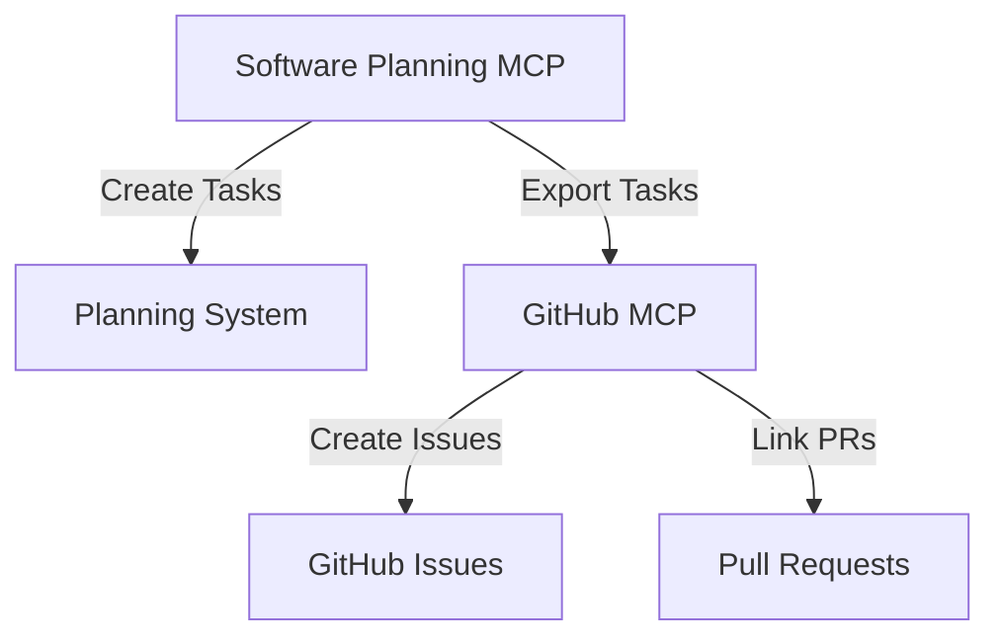

# Software Planning MCP Workflows

This document outlines how to use the Software Planning MCP server for Different Not Less Apparel's development workflow.

## Overview

The Software Planning MCP server provides tools for structured software development planning, task management, and implementation tracking. It helps break down complex features into manageable tasks, track progress, and maintain detailed development plans.

## Available Tools

### 1. `start_planning`
Initiates a new planning session with a specific development goal.

```json
{
  "goal": "string"  // The software development goal to plan
}
```

**Example:**
```json
{
  "goal": "Implement inventory management system for Different Not Less Apparel"
}
```

### 2. `add_todo`
Adds a new todo item to the current plan.

```json
{
  "title": "string",         // Title of the todo item
  "description": "string",   // Detailed description
  "complexity": number,      // Complexity score (0-10)
  "codeExample": "string"    // Optional code example
}
```

**Example:**
```json
{
  "title": "Set up Airtable-Shopify inventory sync",
  "description": "Create a bidirectional sync between Airtable inventory and Shopify products",
  "complexity": 7,
  "codeExample": "// Example webhook handler\napp.post('/webhook/inventory-update', async (req, res) => {\n  const { productId, inventory } = req.body;\n  await updateShopifyInventory(productId, inventory);\n  res.status(200).send('OK');\n});"
}
```

### 3. `get_todos`
Retrieves all todos in the current plan.

```json
// No parameters required
```

### 4. `update_todo_status`
Updates the completion status of a todo item.

```json
{
  "todoId": "string",     // ID of the todo item
  "isComplete": boolean   // New completion status
}
```

**Example:**
```json
{
  "todoId": "1743437118183",
  "isComplete": true
}
```

### 5. `save_plan`
Saves the current implementation plan.

```json
{
  "plan": "string"  // The implementation plan text
}
```

**Example:**
```json
{
  "plan": "# Inventory Management Implementation Plan\n\n## Phase 1: Database Setup\n- Design Airtable schema\n- Set up inventory tracking fields\n\n## Phase 2: Integration\n- Create Shopify-Airtable sync\n- Implement webhooks for updates"
}
```

### 6. `remove_todo`
Removes a todo item from the current plan.

```json
{
  "todoId": "string"  // ID of the todo item to remove
}
```

**Example:**
```json
{
  "todoId": "1743437118183"
}
```

## Workflow Patterns

### Feature Planning Workflow

1. **Start Planning Session**
   ```
   start_planning → { "goal": "Implement feature X" }
   ```

2. **Break Down into Tasks**
   ```
   add_todo → { "title": "Task 1", "description": "...", "complexity": 5 }
   add_todo → { "title": "Task 2", "description": "...", "complexity": 3 }
   ```

3. **Save Implementation Plan**
   ```
   save_plan → { "plan": "# Feature X Implementation Plan\n\n..." }
   ```

4. **Track Implementation Progress**
   ```
   update_todo_status → { "todoId": "...", "isComplete": true }
   ```

### Integration with Other MCP Servers

#### GitHub MCP Integration
1. Use Software Planning to create tasks
2. Use GitHub MCP to create issues from tasks
3. Link PRs to issues for tracking



#### Airtable MCP Integration
1. Plan inventory features with Software Planning
2. Implement database schema in Airtable
3. Track implementation status in both systems

## Best Practices

### 1. Complexity Scoring Guidelines

Use the following guidelines for complexity scoring:

| Score | Description | Example |
|-------|-------------|---------|
| 1-2 | Simple task, minimal dependencies | Update text content |
| 3-4 | Straightforward task, some dependencies | Add a new component |
| 5-6 | Moderate complexity, multiple dependencies | Implement a new feature |
| 7-8 | Complex task, significant dependencies | Create integration between systems |
| 9-10 | Highly complex, critical path, many dependencies | Architect a new system |

### 2. Task Breakdown Guidelines

- Break features into tasks that can be completed in 1-2 days
- Include clear acceptance criteria in descriptions
- Reference related documentation or requirements
- Include code examples for complex implementations

### 3. Implementation Plan Structure

Structure implementation plans with:

1. **Overview**: Brief description of the feature
2. **Phases**: Logical groupings of related tasks
3. **Dependencies**: Requirements and prerequisites
4. **Timeline**: Estimated completion dates
5. **Testing Strategy**: How the feature will be validated

## Example: Inventory Management Planning

```
start_planning → {
  "goal": "Implement inventory management system for Different Not Less Apparel"
}

add_todo → {
  "title": "Design Airtable inventory schema",
  "description": "Create tables for products, variants, and inventory levels with appropriate relationships",
  "complexity": 5
}

add_todo → {
  "title": "Implement Shopify-Airtable sync",
  "description": "Create bidirectional sync between Shopify products and Airtable inventory",
  "complexity": 8,
  "codeExample": "// Webhook handler for inventory updates\n..."
}

save_plan → {
  "plan": "# Inventory Management Implementation Plan\n\n## Phase 1: Schema Design\n..."
}
```

## Troubleshooting

### Common Issues

1. **Missing Todo Items**
   - Ensure you've started a planning session
   - Verify todoId values when updating status

2. **Plan Not Saving**
   - Check for formatting issues in plan text
   - Ensure plan includes all required sections

3. **Complexity Score Errors**
   - Ensure complexity is a number between 0-10

## Related Documentation

- [MCP Inventory Management](./mcp-inventory-management.md)
- [Airtable MCP Workflows](./airtable-mcp-workflows.md)
- [Shopify MCP Workflows](./shopify-mcp-workflows.md)
