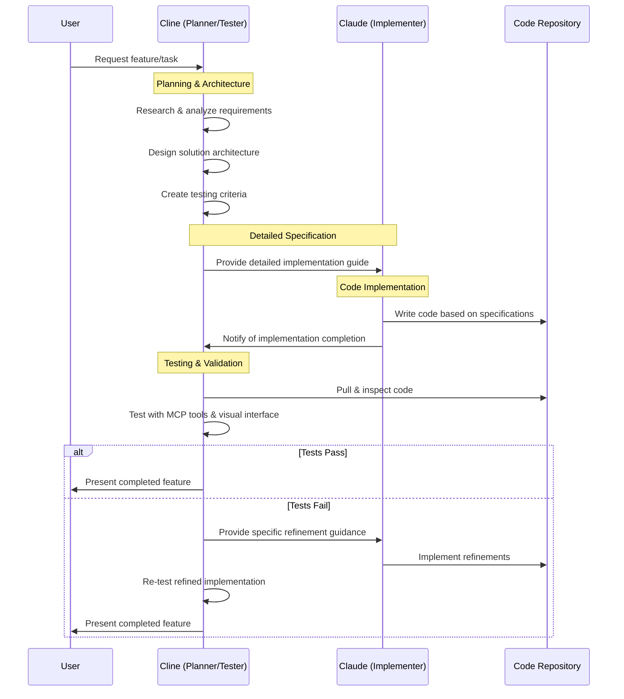

# Claude & Cline Collaboration Framework

This document outlines the collaboration framework between Claude and Cline as co-developers of the Different Not Less project. This approach leverages the unique strengths of each assistant while optimizing for API credit efficiency.

## Core Principles

1. **API Credit Efficiency**: Optimize tasks based on API credit usage
2. **Complementary Capabilities**: Leverage each assistant's unique strengths
3. **Seamless Handoffs**: Maintain comprehensive documentation for continuity
4. **Consistent Standards**: Follow shared coding and documentation standards

## Collaboration Model

## Roles & Responsibilities

### Cline (Planner & Tester)

#### Planning & Architecture
- Analyze project requirements and context
- Design component structures and relationships
- Create data flow diagrams
- Define API contracts and interfaces
- Select appropriate technologies and patterns
- Break down tasks into implementation steps
- Define coding standards and patterns
- Create detailed code templates
- Document expected behaviors and edge cases
- Define acceptance criteria and test cases

#### Testing & Validation
- Run linting and build processes
- Execute tests via MCP tools
- Use browser_action tool for UI testing
- Validate responsive behavior
- Test user flows and interactions
- Capture screenshots for documentation
- Test MCP server integrations
- Validate third-party API connections
- Provide specific feedback on implementation
- Identify optimization opportunities

### Claude (Implementer)

#### Code Implementation
- Follow detailed implementation guides
- Adhere to project coding standards
- Implement logic according to specifications
- Document code as required
- Note implementation challenges or questions
- Provide rationale for any specification deviations
- Create necessary files and components
- Implement styling according to guidelines
- Handle error cases and edge conditions
- Optimize code for performance

## Workflow Process

### 1. Task Initiation & Planning (Cline)
- Review task requirements
- Analyze existing codebase
- Research optimal approaches
- Design architecture and components
- Create detailed implementation specification
- Define testing criteria

### 2. Implementation Handoff (Cline → Claude)
- Document detailed specifications including:
  - File structure and organization
  - Component interfaces and behaviors
  - API integration points
  - State management approach
  - Styling requirements
  - Error handling patterns
- Reference existing code patterns
- Provide code templates where appropriate
- Document any constraints or considerations

### 3. Code Implementation (Claude)
- Create files based on specifications
- Implement component logic
- Style components according to guidelines
- Add appropriate documentation
- Note any implementation challenges
- Document any deviations from specifications

### 4. Implementation Handoff (Claude → Cline)
- Update Knowledge Vault with implementation details
- Document code structure and patterns
- Note any technical debt or limitations
- Highlight areas requiring special testing attention

### 5. Testing & Refinement (Cline)
- Review code for specification adherence
- Test functionality using MCP tools
- Validate UI with browser_action tool
- Test integrations and data flow
- Document test results
- Provide specific refinement guidance if needed

### 6. Refinement Implementation (Claude)
- Address feedback from testing
- Implement refinements as specified
- Document changes made
- Note any remaining concerns

### 7. Final Validation & Delivery (Cline)
- Perform final testing
- Document completed feature
- Update project documentation
- Present completed feature to user

## Knowledge Management

### Shared Documentation Responsibilities
- Both assistants update `activeContext.md` and `progress.md`
- Both contribute to session summaries
- Both maintain code standards documentation

### Cline-Specific Documentation
- Architecture and design documentation
- Testing strategies and results
- MCP integration documentation
- Visual interface documentation

### Claude-Specific Documentation
- Implementation details
- Code structure and patterns
- Technical debt and limitations
- Code-level documentation

## Communication Protocols

### Handoff Documentation Requirements
- Current state documentation in `activeContext.md`
- Updated progress in `progress.md`
- Detailed session summary
- Specific instructions for the other assistant

### Implementation Specification Format
- Clear file paths and names
- Detailed component interfaces
- Explicit API contracts
- Specific styling requirements
- Reference to existing patterns
- Test cases and acceptance criteria

### Feedback Format
- Specific file and line references
- Clear description of issues
- Suggested approaches for resolution
- References to documentation or examples

## Example Workflows

### Adding a New Product Component

1. **Cline Plans & Architects:**
   - Analyzes existing product components
   - Determines optimal structure for new component
   - Creates detailed specification including:
     - Component structure
     - Props interface
     - State management approach
     - API integration points
     - Styling requirements
     - Test cases

2. **Claude Implements:**
   - Creates files based on specifications
   - Implements component logic
   - Styles component according to guidelines
   - Adds appropriate documentation
   - Notes any implementation challenges

3. **Cline Tests & Refines:**
   - Reviews code for adherence to specifications
   - Uses browser_action to visually test component
   - Tests API integrations with relevant MCP tools
   - Validates responsive behavior
   - Provides specific refinement guidance if needed

### Adding Shopify Integration

1. **Cline Plans & Architects:**
   - Researches Shopify API requirements
   - Designs integration architecture
   - Creates API wrapper specification
   - Defines data models and transformations
   - Establishes error handling patterns
   - Outlines testing approach

2. **Claude Implements:**
   - Creates API client based on specification
   - Implements data transformations
   - Adds error handling
   - Creates necessary UI components
   - Documents API usage patterns

3. **Cline Tests & Refines:**
   - Tests API connections using Shopify MCP
   - Validates data flow and transformations
   - Verifies error handling scenarios
   - Tests UI components with browser_action
   - Provides optimization recommendations

## Continuous Improvement

This collaboration framework is a living document that will evolve as we work together. Both assistants should:

1. Document successful patterns in `.clinerules`
2. Update this framework as the project evolves
3. Note especially effective collaboration patterns
4. Identify opportunities to optimize the workflow

## References

- [.clinerules](/.clinerules) - Shared reference for both assistants
- [CLAUDE.md](/CLAUDE.md) - Claude-specific guidelines
- [memory-bank/meta/session-conclusion-workflow.md](/memory-bank/meta/session-conclusion-workflow.md) - Session conclusion process
