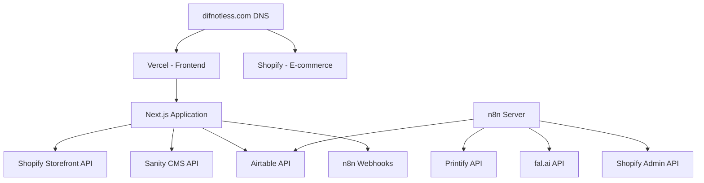

# Domain Architecture for Different Not Less

## Overview

This document outlines the domain architecture and hosting strategy for Different Not Less Apparel. It provides a comprehensive guide to our domain setup, traffic flow, and integration points between various systems.

## Domain Strategy

### Primary Domain
- **difnotless.com**: Points to Vercel-hosted Next.js application
- **www.difnotless.com**: Redirects to difnotless.com (non-www version)

### Subdomains
- **staging.difnotless.com**: Staging environment for testing before production
- **api.difnotless.com**: (Future) API endpoints for headless commerce
- **admin.difnotless.com**: (Future) Admin dashboard for content management

### E-commerce Integration
- **difnotless.myshopify.com**: Shopify backend (not publicly exposed)
- Products and checkout are integrated via Shopify Storefront API

## Architecture Diagram

## Hosting Configuration

### Vercel (Frontend)
- **Repository**: GitHub - different-not-less
- **Framework**: Next.js
- **Build Command**: `npm run build`
- **Output Directory**: `.next`
- **Environment Variables**: Configured in Vercel dashboard and GitHub Secrets

### Shopify (E-commerce)
- **Store URL**: difnotless.myshopify.com
- **Theme**: Headless (API-only)
- **Apps**: Printify integration

### n8n (Workflow Automation)
- **Hosting**: Docker container on VPS
- **URL**: Internal only, accessed via webhooks
- **Authentication**: API key-based

### Sanity (CMS)
- **Project ID**: qquhqgga
- **Dataset**: production
- **API Version**: 2023-03-25

## DNS Configuration

### A Records
- **@**: Points to Vercel's IP
- **www**: Points to Vercel's IP
- **staging**: Points to Vercel's staging environment

### CNAME Records
- **shop**: Points to difnotless.myshopify.com

### TXT Records
- **@**: Verification records for Google Search Console, Bing Webmaster Tools
- **_dmarc**: DMARC policy for email security
- **_domainkey**: DKIM keys for email authentication

## SSL Configuration

- **Certificate Provider**: Let's Encrypt (managed by Vercel)
- **Renewal**: Automatic
- **Coverage**: All subdomains

## Traffic Flow

1. **Customer Visit**:
   - User visits difnotless.com
   - Vercel serves the Next.js application
   - Next.js fetches product data from Shopify Storefront API
   - Content is fetched from Sanity CMS

2. **Product Creation**:
   - Admin triggers product creation workflow
   - n8n orchestrates the process:
     - Generate design with fal.ai
     - Create product in Printify
     - Publish to Shopify
     - Update inventory in Airtable

3. **Checkout Process**:
   - User adds items to cart (managed by Shopify Storefront API)
   - Checkout is handled by Shopify
   - Order confirmation triggers webhook to n8n
   - n8n updates inventory in Airtable

## Integration Points

### Vercel ↔ Shopify
- Storefront API for product display
- Cart and checkout integration
- Order management

### Vercel ↔ Sanity
- Content management for marketing pages
- Product descriptions and rich media
- Collections and categories

### n8n ↔ External Services
- Printify for product creation
- fal.ai for design generation
- Shopify Admin API for product management
- Airtable for inventory tracking

## Monitoring & Performance

- **Uptime Monitoring**: Vercel built-in monitoring
- **Performance Tracking**: Google Analytics 4
- **Error Tracking**: Sentry (to be implemented)
- **Load Testing**: k6 (pre-launch testing)

## Security Measures

- **SSL/TLS**: Enforced on all domains and subdomains
- **HTTP Headers**: Security headers configured in Next.js
- **API Authentication**: Token-based authentication for all services
- **Rate Limiting**: Implemented on critical endpoints

## Disaster Recovery

- **Backups**: Daily automated backups of all systems
- **Rollback Procedure**: GitHub Actions workflow for quick rollbacks
- **Incident Response**: Documented in emergency procedures

## Future Enhancements

- **CDN Integration**: Cloudflare for additional performance
- **Edge Functions**: Vercel Edge Functions for regional customization
- **Multi-region Deployment**: For improved global performance
