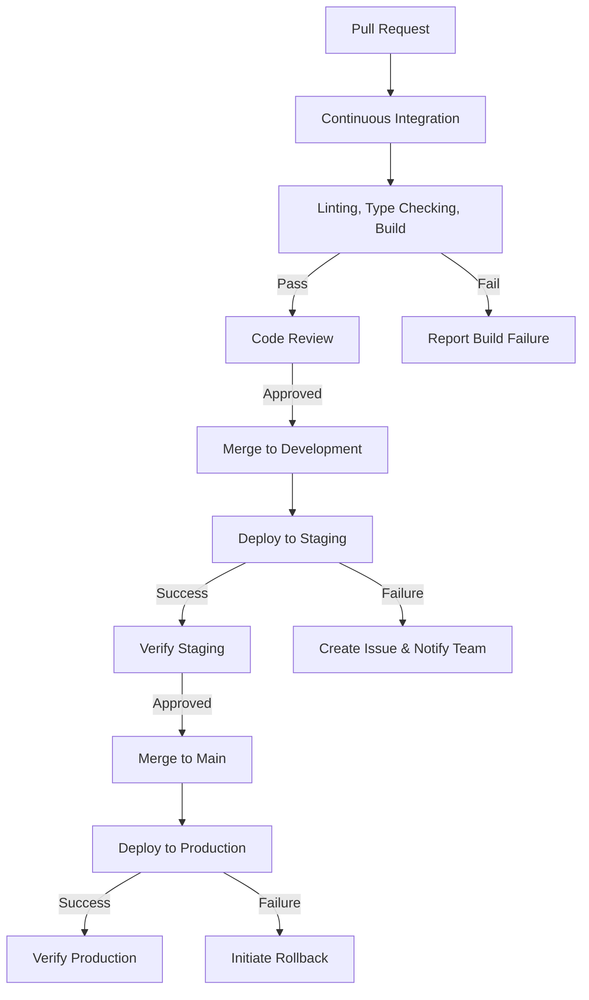

# MCP Integration & CI/CD Workflow

This document outlines the integration of Model Context Protocol (MCP) servers with our CI/CD workflow for Different Not Less Apparel.

## Overview

We've implemented a comprehensive CI/CD pipeline using GitHub Actions and integrated it with various MCP servers to automate and enhance our development workflow. This approach provides:

- Automated testing and deployment
- Consistent quality control
- Streamlined release process
- Robust error handling and reporting
- Efficient rollback capabilities

## CI/CD Pipeline Architecture

## MCP Server Integration

### GitHub MCP Server

The GitHub MCP server is central to our CI/CD automation, providing the following capabilities:

1. **Build Failure Reporting**
   - Automatically creates GitHub issues for failed builds
   - Assigns issues to appropriate team members
   - Includes detailed error information and possible solutions

2. **Automated PR Management**
   - Checks PR status and merges when all checks pass
   - Enforces branch naming conventions
   - Validates PR descriptions and requirements

3. **Deployment Tracking**
   - Records deployment information for each environment
   - Creates deployment tags for easy reference
   - Provides deployment history and status

4. **Rollback Automation**
   - Creates rollback PRs when needed
   - Includes detailed information about the rollback reason
   - Streamlines the emergency response process

### Shopify MCP Server

The Shopify MCP server is integrated with our CI/CD pipeline to:

1. **Validate Product Data**
   - Ensures product data integrity during deployments
   - Verifies Shopify API connectivity
   - Validates product schema changes

2. **Sync Deployment Status**
   - Updates product availability during deployments
   - Manages inventory status during rollouts
   - Coordinates theme updates with code deployments

### Airtable MCP Server

The Airtable MCP server supports our CI/CD process by:

1. **Tracking Deployment Information**
   - Records deployment timestamps and versions
   - Maintains deployment history
   - Links deployments to feature implementations

2. **Managing Test Data**
   - Provides test data for CI/CD pipeline
   - Validates data model changes
   - Ensures data integrity across environments

### Software Planning MCP

The Software Planning MCP enhances our development process by:

1. **Feature Planning**
   - Breaks down features into manageable tasks
   - Assigns complexity scores for better estimation
   - Tracks implementation progress

2. **Release Planning**
   - Organizes features into releases
   - Prioritizes tasks for upcoming deployments
   - Provides visibility into release readiness

## Workflow Files

Our CI/CD pipeline is defined in three main GitHub Actions workflow files:

1. **ci.yml** - Continuous Integration
   - Runs on every push and pull request
   - Performs linting, type checking, and build validation
   - Caches build output for deployment workflows

2. **cd-staging.yml** - Staging Deployment
   - Deploys to staging environment automatically from development branch
   - Sets up environment variables from GitHub Secrets
   - Notifies team of deployment status

3. **cd-production.yml** - Production Deployment
   - Deploys to production environment from main branch
   - Requires manual approval before deployment
   - Creates deployment tags and records deployment information
   - Includes rollback capability

## GitHub MCP Automation Script

We've created a GitHub MCP automation script (`scripts/github-mcp-automation.js`) that provides the following functions:

1. `reportFailedBuild` - Creates GitHub issues for failed builds
2. `autoPRMerge` - Automatically merges PRs that pass all checks
3. `updateDeploymentStatus` - Records deployment information
4. `createRollbackPR` - Creates PRs for emergency rollbacks

## Environment Setup

Our CI/CD pipeline requires the following environment setup:

1. **GitHub Environments**
   - Staging environment (auto-deployment)
   - Production environment (requires approval)

2. **GitHub Secrets**
   - `SHOPIFY_ACCESS_TOKEN`
   - `MYSHOPIFY_DOMAIN`
   - `AIRTABLE_API_KEY`
   - `SANITY_PROJECT_ID`
   - `VERCEL_TOKEN`

3. **Branch Protection Rules**
   - Development branch requires passing CI checks
   - Main branch requires passing CI checks and approval

## Best Practices

1. **Commit Messages**
   - Follow conventional commit format
   - Include ticket number in commit message
   - Keep commits focused and atomic

2. **Pull Requests**
   - Create small, focused PRs
   - Include detailed descriptions
   - Link to relevant issues
   - Add screenshots for UI changes

3. **Testing**
   - Write tests for new features
   - Ensure all tests pass before merging
   - Test manually on staging before production deployment

4. **Deployment**
   - Monitor deployments closely
   - Verify critical functionality after deployment
   - Be prepared to roll back if issues arise

## Future Enhancements

1. **Automated Testing**
   - Implement unit tests with Jest
   - Add integration tests
   - Implement end-to-end tests with Cypress

2. **Performance Monitoring**
   - Add performance testing to CI pipeline
   - Monitor page load times
   - Track Core Web Vitals

3. **Security Scanning**
   - Implement dependency vulnerability scanning
   - Add code security analysis
   - Perform regular security audits

## Troubleshooting

### Common Issues

1. **Failed Builds**
   - Check error messages in GitHub Actions logs
   - Verify environment variables are correctly set
   - Ensure dependencies are properly installed

2. **Deployment Failures**
   - Check Vercel deployment logs
   - Verify API tokens are valid
   - Check for environment-specific issues

3. **Rollback Process**
   - Use the `createRollbackPR` function
   - Get expedited approval for the rollback
   - Verify the rollback resolves the issue

## References

- [GitHub Actions Documentation](https://docs.github.com/en/actions)
- [Vercel Deployment Documentation](https://vercel.com/docs/deployments/overview)
- [MCP Server Documentation](https://github.com/modelcontextprotocol/servers)
