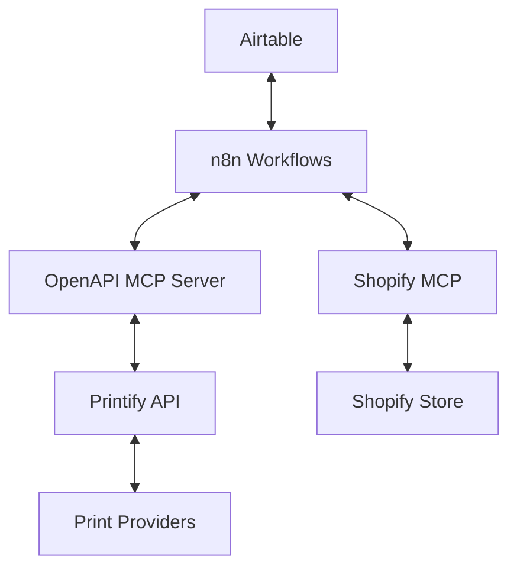
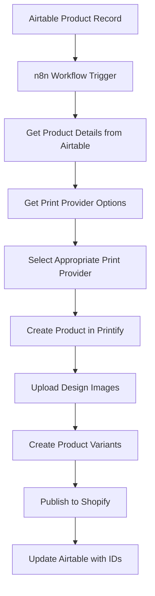
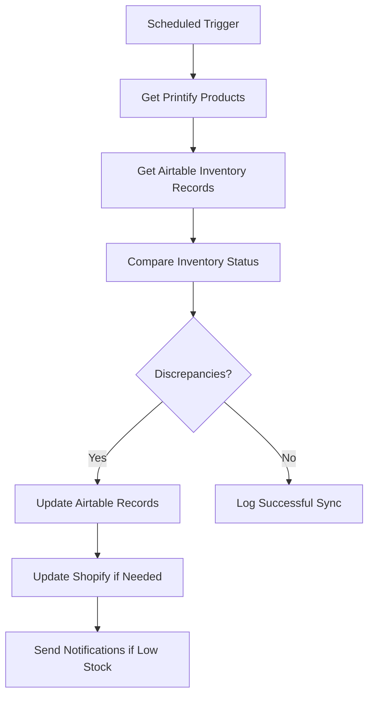
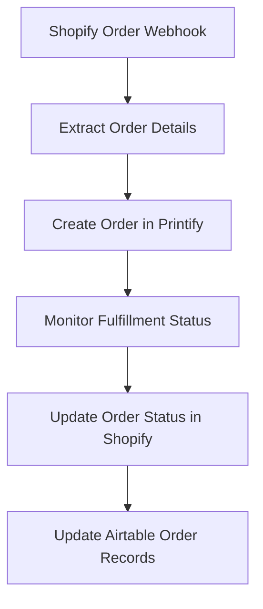

# Printify OpenAPI MCP Integration

## Overview

This document outlines the plan for integrating Printify with the Different Not Less e-commerce ecosystem using the OpenAPI MCP server. This integration will streamline product creation, inventory management, and order fulfillment processes by providing a standardized API interface to Printify's services.

## Background

Different Not Less currently uses a combination of Shopify, Airtable, and n8n for e-commerce operations, product management, and workflow automation. While a basic Printify connection has been established, a more robust and maintainable integration is needed to scale operations efficiently.

## Integration Architecture



## OpenAPI Specification

The foundation of this integration will be a comprehensive OpenAPI specification for the Printify API. This specification will be used to configure the OpenAPI MCP server.

### Base Configuration

```yaml
openapi: 3.0.0
info:
  title: Printify API
  description: API for managing print-on-demand products and orders with Printify
  version: 1.0.0
servers:
  - url: https://api.printify.com/v1
security:
  - ApiKeyAuth: []
```

### Authentication

```yaml
components:
  securitySchemes:
    ApiKeyAuth:
      type: apiKey
      in: header
      name: Authorization
```

### Core Endpoints

The specification will include the following key endpoints:

#### Shops

```yaml
paths:
  /shops:
    get:
      summary: Get all shops
      description: Returns a list of all shops available to the authenticated user
      responses:
        '200':
          description: Successful operation
          content:
            application/json:
              schema:
                type: array
                items:
                  $ref: '#/components/schemas/Shop'
  
  /shops/{shop_id}:
    get:
      summary: Get shop by ID
      parameters:
        - name: shop_id
          in: path
          required: true
          schema:
            type: string
      responses:
        '200':
          description: Successful operation
          content:
            application/json:
              schema:
                $ref: '#/components/schemas/Shop'
```

#### Products

```yaml
paths:
  /shops/{shop_id}/products:
    get:
      summary: Get all products
      parameters:
        - name: shop_id
          in: path
          required: true
          schema:
            type: string
      responses:
        '200':
          description: Successful operation
          content:
            application/json:
              schema:
                type: array
                items:
                  $ref: '#/components/schemas/Product'
    
    post:
      summary: Create a product
      parameters:
        - name: shop_id
          in: path
          required: true
          schema:
            type: string
      requestBody:
        required: true
        content:
          application/json:
            schema:
              $ref: '#/components/schemas/ProductCreate'
      responses:
        '201':
          description: Product created
          content:
            application/json:
              schema:
                $ref: '#/components/schemas/Product'
  
  /shops/{shop_id}/products/{product_id}:
    get:
      summary: Get product by ID
      parameters:
        - name: shop_id
          in: path
          required: true
          schema:
            type: string
        - name: product_id
          in: path
          required: true
          schema:
            type: string
      responses:
        '200':
          description: Successful operation
          content:
            application/json:
              schema:
                $ref: '#/components/schemas/Product'
    
    put:
      summary: Update a product
      parameters:
        - name: shop_id
          in: path
          required: true
          schema:
            type: string
        - name: product_id
          in: path
          required: true
          schema:
            type: string
      requestBody:
        required: true
        content:
          application/json:
            schema:
              $ref: '#/components/schemas/ProductUpdate'
      responses:
        '200':
          description: Product updated
          content:
            application/json:
              schema:
                $ref: '#/components/schemas/Product'
    
    delete:
      summary: Delete a product
      parameters:
        - name: shop_id
          in: path
          required: true
          schema:
            type: string
        - name: product_id
          in: path
          required: true
          schema:
            type: string
      responses:
        '204':
          description: Product deleted
```

#### Print Providers

```yaml
paths:
  /print_providers:
    get:
      summary: Get all print providers
      responses:
        '200':
          description: Successful operation
          content:
            application/json:
              schema:
                type: array
                items:
                  $ref: '#/components/schemas/PrintProvider'
  
  /print_providers/{provider_id}:
    get:
      summary: Get print provider by ID
      parameters:
        - name: provider_id
          in: path
          required: true
          schema:
            type: string
      responses:
        '200':
          description: Successful operation
          content:
            application/json:
              schema:
                $ref: '#/components/schemas/PrintProvider'
  
  /print_providers/{provider_id}/blueprints:
    get:
      summary: Get all blueprints for a print provider
      parameters:
        - name: provider_id
          in: path
          required: true
          schema:
            type: string
      responses:
        '200':
          description: Successful operation
          content:
            application/json:
              schema:
                type: array
                items:
                  $ref: '#/components/schemas/Blueprint'
```

#### Publishing

```yaml
paths:
  /shops/{shop_id}/products/{product_id}/publish:
    post:
      summary: Publish a product to a sales channel
      parameters:
        - name: shop_id
          in: path
          required: true
          schema:
            type: string
        - name: product_id
          in: path
          required: true
          schema:
            type: string
      requestBody:
        required: true
        content:
          application/json:
            schema:
              $ref: '#/components/schemas/PublishRequest'
      responses:
        '200':
          description: Product published
          content:
            application/json:
              schema:
                $ref: '#/components/schemas/PublishResult'
```

#### Orders

```yaml
paths:
  /shops/{shop_id}/orders:
    get:
      summary: Get all orders
      parameters:
        - name: shop_id
          in: path
          required: true
          schema:
            type: string
      responses:
        '200':
          description: Successful operation
          content:
            application/json:
              schema:
                type: array
                items:
                  $ref: '#/components/schemas/Order'
    
    post:
      summary: Create an order
      parameters:
        - name: shop_id
          in: path
          required: true
          schema:
            type: string
      requestBody:
        required: true
        content:
          application/json:
            schema:
              $ref: '#/components/schemas/OrderCreate'
      responses:
        '201':
          description: Order created
          content:
            application/json:
              schema:
                $ref: '#/components/schemas/Order'
```

### Data Models

```yaml
components:
  schemas:
    Shop:
      type: object
      properties:
        id:
          type: string
        title:
          type: string
        sales_channel:
          type: string
          enum: [shopify, etsy, woocommerce, custom]
    
    Product:
      type: object
      properties:
        id:
          type: string
        title:
          type: string
        description:
          type: string
        blueprint_id:
          type: string
        print_provider_id:
          type: string
        variants:
          type: array
          items:
            $ref: '#/components/schemas/Variant'
        images:
          type: array
          items:
            $ref: '#/components/schemas/Image'
        options:
          type: array
          items:
            $ref: '#/components/schemas/Option'
        tags:
          type: array
          items:
            type: string
        published:
          type: boolean
        external_id:
          type: string
          description: ID in external system (e.g., Shopify)
    
    ProductCreate:
      type: object
      required:
        - title
        - blueprint_id
        - print_provider_id
      properties:
        title:
          type: string
        description:
          type: string
        blueprint_id:
          type: string
        print_provider_id:
          type: string
        variants:
          type: array
          items:
            $ref: '#/components/schemas/VariantCreate'
        images:
          type: array
          items:
            $ref: '#/components/schemas/ImageCreate'
        tags:
          type: array
          items:
            type: string
    
    ProductUpdate:
      type: object
      properties:
        title:
          type: string
        description:
          type: string
        variants:
          type: array
          items:
            $ref: '#/components/schemas/VariantUpdate'
        images:
          type: array
          items:
            $ref: '#/components/schemas/ImageUpdate'
        tags:
          type: array
          items:
            type: string
    
    Variant:
      type: object
      properties:
        id:
          type: string
        price:
          type: number
        is_enabled:
          type: boolean
        sku:
          type: string
        options:
          type: object
          additionalProperties: true
    
    VariantCreate:
      type: object
      required:
        - price
        - options
      properties:
        price:
          type: number
        is_enabled:
          type: boolean
          default: true
        sku:
          type: string
        options:
          type: object
          additionalProperties: true
    
    VariantUpdate:
      type: object
      properties:
        id:
          type: string
        price:
          type: number
        is_enabled:
          type: boolean
        sku:
          type: string
    
    Image:
      type: object
      properties:
        id:
          type: string
        file_name:
          type: string
        url:
          type: string
        position:
          type: integer
        is_default:
          type: boolean
    
    ImageCreate:
      type: object
      required:
        - file_name
        - url
      properties:
        file_name:
          type: string
        url:
          type: string
        position:
          type: integer
        is_default:
          type: boolean
    
    ImageUpdate:
      type: object
      properties:
        id:
          type: string
        position:
          type: integer
        is_default:
          type: boolean
    
    Option:
      type: object
      properties:
        name:
          type: string
        type:
          type: string
        values:
          type: array
          items:
            type: string
    
    PrintProvider:
      type: object
      properties:
        id:
          type: string
        title:
          type: string
        location:
          type: string
    
    Blueprint:
      type: object
      properties:
        id:
          type: string
        title:
          type: string
        description:
          type: string
        brand:
          type: string
        model:
          type: string
        images:
          type: array
          items:
            type: object
            properties:
              url:
                type: string
        options:
          type: array
          items:
            $ref: '#/components/schemas/BlueprintOption'
        print_areas:
          type: array
          items:
            $ref: '#/components/schemas/PrintArea'
    
    BlueprintOption:
      type: object
      properties:
        name:
          type: string
        type:
          type: string
        values:
          type: array
          items:
            type: object
            properties:
              id:
                type: string
              title:
                type: string
    
    PrintArea:
      type: object
      properties:
        id:
          type: string
        title:
          type: string
        width:
          type: number
        height:
          type: number
    
    PublishRequest:
      type: object
      required:
        - external_id
        - sales_channel
      properties:
        external_id:
          type: string
          description: ID in external system (e.g., Shopify)
        sales_channel:
          type: string
          enum: [shopify, etsy, woocommerce, custom]
        title:
          type: string
        description:
          type: string
        handle:
          type: string
        tags:
          type: array
          items:
            type: string
        options:
          type: object
          additionalProperties: true
    
    PublishResult:
      type: object
      properties:
        success:
          type: boolean
        message:
          type: string
        product_id:
          type: string
        external_id:
          type: string
    
    Order:
      type: object
      properties:
        id:
          type: string
        external_id:
          type: string
        status:
          type: string
          enum: [pending, processing, fulfilled, canceled]
        shipping_method:
          type: string
        shipping_address:
          $ref: '#/components/schemas/Address'
        line_items:
          type: array
          items:
            $ref: '#/components/schemas/LineItem'
        costs:
          $ref: '#/components/schemas/Costs'
        created_at:
          type: string
          format: date-time
        updated_at:
          type: string
          format: date-time
    
    OrderCreate:
      type: object
      required:
        - external_id
        - shipping_method
        - shipping_address
        - line_items
      properties:
        external_id:
          type: string
        shipping_method:
          type: string
        shipping_address:
          $ref: '#/components/schemas/Address'
        line_items:
          type: array
          items:
            $ref: '#/components/schemas/LineItemCreate'
    
    Address:
      type: object
      properties:
        first_name:
          type: string
        last_name:
          type: string
        email:
          type: string
        phone:
          type: string
        address1:
          type: string
        address2:
          type: string
        city:
          type: string
        state:
          type: string
        zip:
          type: string
        country:
          type: string
    
    LineItem:
      type: object
      properties:
        id:
          type: string
        product_id:
          type: string
        variant_id:
          type: string
        quantity:
          type: integer
        price:
          type: number
        sku:
          type: string
        title:
          type: string
    
    LineItemCreate:
      type: object
      required:
        - product_id
        - variant_id
        - quantity
      properties:
        product_id:
          type: string
        variant_id:
          type: string
        quantity:
          type: integer
    
    Costs:
      type: object
      properties:
        subtotal:
          type: number
        shipping:
          type: number
        tax:
          type: number
        total:
          type: number
```

## Implementation Plan

### Phase 1: Setup and Configuration (2 days)

1. Install and configure the OpenAPI MCP server
2. Create the complete Printify OpenAPI specification
3. Set up authentication with Printify API
4. Test basic connectivity and operations

### Phase 2: Core Workflows Implementation (5 days)

#### Product Creation Workflow



#### Inventory Sync Workflow



#### Order Processing Workflow



### Phase 3: Testing and Optimization (3 days)

1. End-to-end testing of all workflows
2. Performance optimization
3. Error handling and retry logic
4. Monitoring and alerting setup

### Phase 4: Documentation and Training (2 days)

1. Complete technical documentation
2. Create user guides for operations team
3. Training sessions for relevant team members

### Phase 5: Deployment and Monitoring (2 days)

1. Staged deployment to production
2. Monitoring setup
3. Post-deployment verification

## Integration Touchpoints

### Airtable Integration

The Printify OpenAPI MCP will interact with Airtable for:

1. Product data retrieval
2. Inventory updates
3. Order tracking
4. Design asset management

### Shopify Integration

The integration will connect with Shopify for:

1. Product publishing
2. Order synchronization
3. Inventory management
4. Pricing updates

### n8n Workflow Integration

n8n will orchestrate the workflows between systems:

1. Trigger workflows based on events
2. Process data transformations
3. Handle error conditions and retries
4. Schedule recurring tasks

## Resource Requirements

- Developer time: 14 days (2-3 weeks)
- Printify API credentials
- OpenAPI MCP server setup
- Testing environment

## Potential Challenges and Mitigations

| Challenge | Mitigation |
|-----------|------------|
| Printify API rate limits | Implement request throttling and queuing |
| Image upload performance | Optimize image processing and consider CDN |
| Order status synchronization | Implement webhook handlers and polling fallback |
| Error handling across systems | Comprehensive logging and notification system |
| Data consistency | Regular reconciliation jobs and validation |

## Future Enhancements

1. **Advanced Analytics**: Track production times, costs, and quality metrics
2. **Customer Portal**: Allow customers to track production status
3. **Design Automation**: Integrate with design generation tools
4. **Multi-vendor Strategy**: Support multiple print providers for redundancy
5. **Quality Control**: Automated quality verification workflows

## Conclusion

This Printify OpenAPI MCP integration will significantly enhance the Different Not Less e-commerce operations by automating product creation, inventory management, and order fulfillment processes. By standardizing the API interface through OpenAPI specifications, we ensure maintainability and scalability as the business grows.

The implementation will be scheduled for post-launch (starting April 30, 2025) to allow for successful launch operations and initial customer feedback collection before adding this enhancement.
