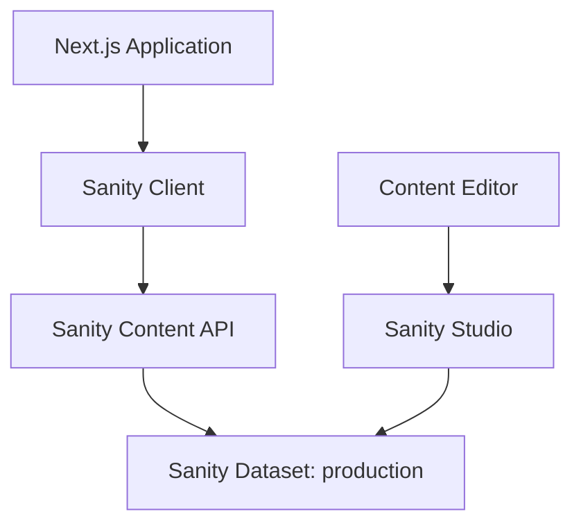

# Sanity CMS Integration for Different Not Less

## Overview

This document outlines the integration of Sanity CMS with the Different Not Less Apparel website. Sanity provides a flexible, headless content management system that allows for structured content creation and delivery via APIs.

## Architecture



## Setup & Configuration

### Project Configuration

- **Project ID**: qquhqgga
- **Dataset**: production
- **API Version**: 2023-03-25
- **Token**: sk5XV7gTMg2KZGNsUjRGO0YLYyYBqgUhRSBIovlRIJhaHQEx82HWgicSCXtu0pYrt9ypAFynUxe3LVgqC8vDOJ9NmTsbUWkgrETRth4yUTNTaDj4G72EaHzRd9VVCco7xap5UimanAiwd7zBUX2gxU5ntmiEeq43tGmwbM4tCaFl4MZVlUBU

### Client Setup

```javascript
// lib/sanity.js
import { createClient } from '@sanity/client';
import imageUrlBuilder from '@sanity/image-url';

export const client = createClient({
  projectId: process.env.NEXT_PUBLIC_SANITY_PROJECT_ID,
  dataset: process.env.NEXT_PUBLIC_SANITY_DATASET,
  apiVersion: process.env.NEXT_PUBLIC_SANITY_API_VERSION,
  token: process.env.SANITY_API_TOKEN, // Only needed for write operations
  useCdn: true, // Set to false for real-time data
});

// Helper function for image URL generation
const builder = imageUrlBuilder(client);
export const urlFor = (source) => builder.image(source);

// Helper function for fetching data
export async function fetchSanityData(query, params = {}) {
  try {
    return await client.fetch(query, params);
  } catch (error) {
    console.error('Sanity fetch error:', error);
    return null;
  }
}
```

## Schema Definitions

### Product Schema

```javascript
// schemas/product.js
export default {
  name: 'product',
  title: 'Product',
  type: 'document',
  fields: [
    {
      name: 'title',
      title: 'Title',
      type: 'string',
      validation: Rule => Rule.required()
    },
    {
      name: 'slug',
      title: 'Slug',
      type: 'slug',
      options: {
        source: 'title',
        maxLength: 96
      },
      validation: Rule => Rule.required()
    },
    {
      name: 'shopifyProductId',
      title: 'Shopify Product ID',
      type: 'string',
      validation: Rule => Rule.required()
    },
    {
      name: 'printifyProductId',
      title: 'Printify Product ID',
      type: 'string'
    },
    {
      name: 'description',
      title: 'Description',
      type: 'array',
      of: [{ type: 'block' }]
    },
    {
      name: 'mainImage',
      title: 'Main Image',
      type: 'image',
      options: {
        hotspot: true
      }
    },
    {
      name: 'images',
      title: 'Additional Images',
      type: 'array',
      of: [{ type: 'image', options: { hotspot: true } }]
    },
    {
      name: 'collections',
      title: 'Collections',
      type: 'array',
      of: [{ type: 'reference', to: { type: 'collection' } }]
    },
    {
      name: 'tags',
      title: 'Tags',
      type: 'array',
      of: [{ type: 'string' }],
      options: {
        layout: 'tags'
      }
    },
    {
      name: 'sensoryFeatures',
      title: 'Sensory Features',
      type: 'array',
      of: [{ type: 'reference', to: { type: 'sensoryFeature' } }]
    },
    {
      name: 'seo',
      title: 'SEO',
      type: 'seo'
    }
  ],
  preview: {
    select: {
      title: 'title',
      media: 'mainImage'
    }
  }
};
```

### Collection Schema

```javascript
// schemas/collection.js
export default {
  name: 'collection',
  title: 'Collection',
  type: 'document',
  fields: [
    {
      name: 'title',
      title: 'Title',
      type: 'string',
      validation: Rule => Rule.required()
    },
    {
      name: 'slug',
      title: 'Slug',
      type: 'slug',
      options: {
        source: 'title',
        maxLength: 96
      },
      validation: Rule => Rule.required()
    },
    {
      name: 'description',
      title: 'Description',
      type: 'array',
      of: [{ type: 'block' }]
    },
    {
      name: 'image',
      title: 'Collection Image',
      type: 'image',
      options: {
        hotspot: true
      }
    },
    {
      name: 'featured',
      title: 'Featured Collection',
      type: 'boolean',
      description: 'Show this collection on the homepage'
    },
    {
      name: 'order',
      title: 'Display Order',
      type: 'number',
      description: 'Order to display collections (lower numbers first)'
    },
    {
      name: 'seo',
      title: 'SEO',
      type: 'seo'
    }
  ]
};
```

### Sensory Feature Schema

```javascript
// schemas/sensoryFeature.js
export default {
  name: 'sensoryFeature',
  title: 'Sensory Feature',
  type: 'document',
  fields: [
    {
      name: 'name',
      title: 'Name',
      type: 'string',
      validation: Rule => Rule.required()
    },
    {
      name: 'description',
      title: 'Description',
      type: 'text'
    },
    {
      name: 'icon',
      title: 'Icon',
      type: 'image'
    },
    {
      name: 'category',
      title: 'Category',
      type: 'string',
      options: {
        list: [
          { title: 'Texture', value: 'texture' },
          { title: 'Sound', value: 'sound' },
          { title: 'Visual', value: 'visual' },
          { title: 'Fit', value: 'fit' }
        ]
      }
    }
  ]
};
```

### SEO Schema

```javascript
// schemas/objects/seo.js
export default {
  name: 'seo',
  title: 'SEO',
  type: 'object',
  fields: [
    {
      name: 'metaTitle',
      title: 'Meta Title',
      type: 'string',
      description: 'Title used for search engines and browser tabs',
      validation: Rule => Rule.max(60).warning('Should be under 60 characters')
    },
    {
      name: 'metaDescription',
      title: 'Meta Description',
      type: 'text',
      rows: 3,
      description: 'Description for search engines',
      validation: Rule => Rule.max(160).warning('Should be under 160 characters')
    },
    {
      name: 'openGraphImage',
      title: 'Open Graph Image',
      type: 'image',
      description: 'Image for sharing on social media (Facebook, Twitter, etc.)',
      options: {
        hotspot: true
      }
    }
  ]
};
```

## Query Examples

### Fetch All Products

```javascript
export async function getAllProducts() {
  const query = `*[_type == "product"] {
    _id,
    title,
    slug,
    shopifyProductId,
    "description": description[]{
      ...,
      _type == "block" => {
        ...,
        "children": children[]{
          ...
        }
      }
    },
    "mainImageUrl": mainImage.asset->url,
    "collections": collections[]->{ _id, title, slug },
    tags
  }`;
  
  return await fetchSanityData(query);
}
```

### Fetch Product by Slug

```javascript
export async function getProductBySlug(slug) {
  const query = `*[_type == "product" && slug.current == $slug][0] {
    _id,
    title,
    slug,
    shopifyProductId,
    printifyProductId,
    "description": description[]{
      ...,
      _type == "block" => {
        ...,
        "children": children[]{
          ...
        }
      }
    },
    "mainImageUrl": mainImage.asset->url,
    "images": images[].asset->url,
    "collections": collections[]->{ _id, title, slug },
    tags,
    "sensoryFeatures": sensoryFeatures[]->{ name, description, "iconUrl": icon.asset->url, category },
    "seo": seo {
      metaTitle,
      metaDescription,
      "openGraphImageUrl": openGraphImage.asset->url
    }
  }`;
  
  return await fetchSanityData(query, { slug });
}
```

### Fetch Collections

```javascript
export async function getCollections(featured = false) {
  let featuredFilter = '';
  if (featured) {
    featuredFilter = ' && featured == true';
  }
  
  const query = `*[_type == "collection"${featuredFilter}] | order(order asc) {
    _id,
    title,
    slug,
    "description": description[]{
      ...,
      _type == "block" => {
        ...,
        "children": children[]{
          ...
        }
      }
    },
    "imageUrl": image.asset->url,
    featured,
    order,
    "productCount": count(*[_type == "product" && references(^._id)])
  }`;
  
  return await fetchSanityData(query);
}
```

## Next.js Integration

### Product Page Example

```javascript
// pages/products/[slug].js
import { getProductBySlug, getAllProducts } from '../../lib/sanity';
import { urlFor } from '../../lib/sanity';
import ProductDetails from '../../components/ProductDetails';

export default function ProductPage({ product }) {
  if (!product) return <div>Product not found</div>;
  
  return (
    <ProductDetails 
      product={product}
      imageUrl={product.mainImageUrl}
      additionalImages={product.images}
      sensoryFeatures={product.sensoryFeatures}
    />
  );
}

export async function getStaticProps({ params }) {
  const product = await getProductBySlug(params.slug);
  
  return {
    props: {
      product
    },
    revalidate: 60 // Revalidate every minute
  };
}

export async function getStaticPaths() {
  const products = await getAllProducts();
  
  return {
    paths: products.map(product => ({
      params: { slug: product.slug.current }
    })),
    fallback: 'blocking'
  };
}
```

### Collection Page Example

```javascript
// pages/collections/[slug].js
import { getCollections } from '../../lib/sanity';
import CollectionProducts from '../../components/CollectionProducts';

export default function CollectionPage({ collection, products }) {
  if (!collection) return <div>Collection not found</div>;
  
  return (
    <CollectionProducts 
      collection={collection}
      products={products}
    />
  );
}

export async function getStaticProps({ params }) {
  const collections = await getCollections();
  const collection = collections.find(c => c.slug.current === params.slug);
  
  // Fetch products for this collection
  const products = await fetchSanityData(`
    *[_type == "product" && references(*[_type == "collection" && slug.current == $slug]._id)] {
      _id,
      title,
      slug,
      "mainImageUrl": mainImage.asset->url,
      tags
    }
  `, { slug: params.slug });
  
  return {
    props: {
      collection,
      products
    },
    revalidate: 60
  };
}

export async function getStaticPaths() {
  const collections = await getCollections();
  
  return {
    paths: collections.map(collection => ({
      params: { slug: collection.slug.current }
    })),
    fallback: 'blocking'
  };
}
```

## Content Editing Workflow

### Content Creation Process

1. **Login to Sanity Studio**
   - Access via https://difnotless.sanity.studio/
   - Use authorized credentials

2. **Creating New Products**
   - Navigate to "Products" section
   - Click "Create new product"
   - Fill in required fields
   - Add Shopify Product ID from Shopify admin
   - Upload product images
   - Assign to collections
   - Add sensory features
   - Configure SEO settings

3. **Managing Collections**
   - Navigate to "Collections" section
   - Create or edit collections
   - Set featured status and display order
   - Add collection image and description

4. **Content Publishing**
   - Review changes in preview mode
   - Publish when ready
   - Changes propagate to website within 1 minute (via ISR)

### Best Practices

- **Image Optimization**
  - Use high-quality product images (2000px+ width)
  - Enable hotspot for responsive cropping
  - Add alt text for accessibility

- **Content Structure**
  - Use structured content blocks for rich text
  - Break descriptions into logical sections
  - Use headings and lists for readability

- **SEO Optimization**
  - Always fill in SEO fields
  - Use keyword-rich titles and descriptions
  - Provide unique meta descriptions for each page

## Deployment Considerations

### Production Setup

- **Environment Variables**
  - NEXT_PUBLIC_SANITY_PROJECT_ID
  - NEXT_PUBLIC_SANITY_DATASET
  - NEXT_PUBLIC_SANITY_API_VERSION
  - SANITY_API_TOKEN (for write operations)

- **CORS Configuration**
  - Configure allowed origins in Sanity dashboard
  - Add production domain to CORS origins

- **Preview Configuration**
  - Set up preview secret
  - Configure preview routes in Next.js

### Performance Optimization

- **CDN Usage**
  - Enable CDN for read-only operations
  - Disable for real-time preview

- **Image Optimization**
  - Use Sanity's image pipeline
  - Implement responsive images
  - Use Next.js Image component

- **Incremental Static Regeneration**
  - Set appropriate revalidation times
  - Use fallback strategies for new content

## Troubleshooting

### Common Issues

- **Missing Content**
  - Check document ID references
  - Verify content is published
  - Check query parameters

- **Image Loading Issues**
  - Verify asset references
  - Check image transformations
  - Confirm hotspot configuration

- **API Errors**
  - Verify API token permissions
  - Check rate limiting
  - Validate CORS configuration

### Debugging Tools

- **Sanity Vision**
  - Access via Sanity Studio
  - Test GROQ queries
  - Inspect document structure

- **Next.js Development Tools**
  - Use React DevTools
  - Check network requests
  - Verify data fetching

## Resources

- [Sanity Documentation](https://www.sanity.io/docs)
- [GROQ Query Language](https://www.sanity.io/docs/groq)
- [Next.js Integration Guide](https://www.sanity.io/guides/nextjs-app-router-sanity)
- [Image URL Builder](https://www.sanity.io/docs/image-url)
