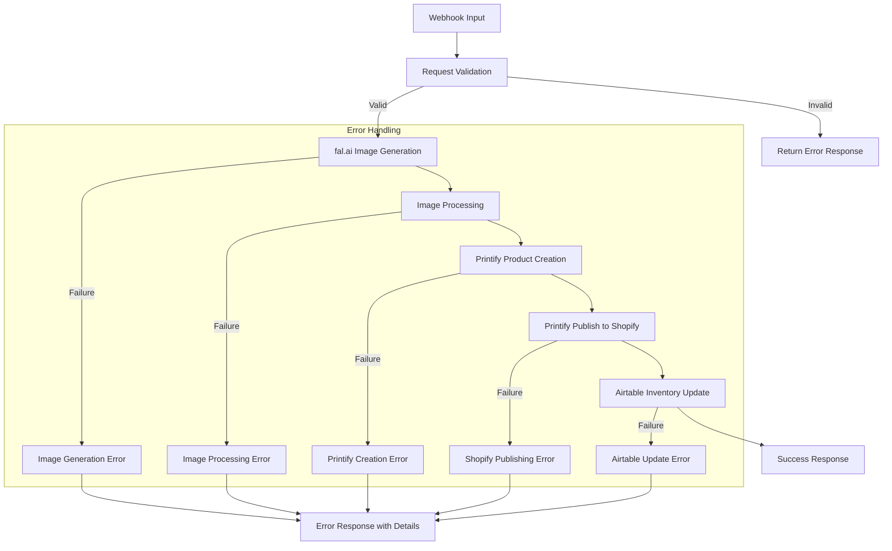

# Different Not Less Apparel - n8n Workflow Documentation

This document provides detailed information about the n8n workflow for automating the product creation process for Different Not Less Apparel.

## Table of Contents

- [Workflow Architecture](#workflow-architecture)
- [Node Descriptions](#node-descriptions)
- [Setup Instructions](#setup-instructions)
- [API Integration Details](#api-integration-details)
- [Testing and Validation](#testing-and-validation)
- [Customization Guide](#customization-guide)
- [Error Handling](#error-handling)
- [Security Best Practices](#security-best-practices)
- [Monitoring and Maintenance](#monitoring-and-maintenance)
- [Troubleshooting](#troubleshooting)
- [FAQ](#faq)

## Workflow Architecture

The workflow follows a linear process flow:



## Node Descriptions

### 1. Webhook

- **Purpose**: Receives incoming HTTP requests with product creation data
- **Configuration**:
  - Path: `/product-creation`
  - Method: POST
  - Authentication: API Key (header: `x-api-key`)
- **Input**: JSON payload with product details
- **Output**: Passes the request body to the validation node

### 2. Validate Request

- **Purpose**: Validates the incoming request data
- **Key Functions**:
  - Checks for required fields (prompt, productType, title)
  - Validates product type against allowed values
  - Sets defaults for optional fields
  - Enhances the prompt for better image generation
  - Maps product type to Printify blueprint ID
- **Output**: Either error response or validated data

### 3. Route Request

- **Purpose**: Routes the request based on validation result
- **Logic**: Checks if validation produced an error, if so returns the error, otherwise continues the workflow

### 4. fal.ai Image Generation

- **Purpose**: Generates t-shirt design image using fal.ai API
- **Configuration**:
  - Model: stable-diffusion-xl-1024-v1-0
  - Output format: PNG with transparency
  - Dimensions: 4500x5400px
- **Input**: Enhanced prompt from validation
- **Output**: Image generation result with URL

### 5. Process Image

- **Purpose**: Processes the generated image for use with Printify
- **Key Functions**:
  - Extracts image URL from fal.ai response
  - Prepares data structure for Printify API
  - Generates variant combinations based on colors and sizes
  - Calculates pricing based on product size
- **Output**: Processed data ready for Printify

### 6. Create Printify Product

- **Purpose**: Creates a new product in Printify
- **Configuration**:
  - Uses Printify API to create product with variants
  - Sets up print areas with the generated design
  - Configures product metadata (title, description, tags)
- **Input**: Processed data from previous node
- **Output**: Printify API response with product ID

### 7. Process Printify Response

- **Purpose**: Processes the Printify API response
- **Key Functions**:
  - Extracts Printify product ID
  - Prepares data for publishing to Shopify
- **Output**: Data ready for Shopify publishing

### 8. Publish to Shopify

- **Purpose**: Publishes the Printify product to Shopify
- **Configuration**:
  - Uses Printify's publish endpoint to push to Shopify
  - Enables the product on Shopify
- **Input**: Printify product ID and publishing data
- **Output**: Publishing response with Shopify product ID

### 9. Process Shopify Response

- **Purpose**: Processes the Shopify publishing response
- **Key Functions**:
  - Extracts Shopify product ID
  - Generates Shopify product URL
  - Prepares data for Airtable update
- **Output**: Data ready for Airtable update

### 10. Update Airtable

- **Purpose**: Creates a record in Airtable for inventory tracking
- **Configuration**:
  - Creates record in the Products table
  - Stores all product information and IDs
- **Input**: Product data with Printify and Shopify IDs
- **Output**: Airtable API response with record ID

### 11. Format Response

- **Purpose**: Formats the final response to the webhook
- **Key Functions**:
  - Compiles all relevant product IDs and URLs
  - Creates a standardized success response
- **Output**: Final response object

### 12. Respond to Webhook

- **Purpose**: Sends the response back to the webhook caller
- **Configuration**:
  - Returns JSON response with status and product details
- **Input**: Formatted response from previous node
- **Output**: HTTP response to the original webhook request

## Setup Instructions

### Prerequisites

1. **API Accounts and Keys**:
   - fal.ai account with API key
   - Printify account with API key and shop ID
   - Airtable account with API key and base ID
   - Shopify store connected to Printify

2. **n8n Installation**:
   - Docker and Docker Compose installed
   - Or n8n installed directly on your server

### Detailed Setup Steps

1. **Clone the Repository**:
   ```bash
   git clone https://github.com/your-repo/different-not-less.git
   cd different-not-less/n8n
   ```

2. **Configure Environment Variables**:
   ```bash
   cp .env.example .env
   # Edit .env with your API keys and configuration
   ```

3. **Start n8n**:
   ```bash
   ./setup.sh
   ```
   Or manually with Docker Compose:
   ```bash
   docker-compose up -d
   ```

4. **Import the Workflow**:
   - Open n8n in your browser (default: http://localhost:5678)
   - Go to Workflows > Import from File
   - Select `product-creation-workflow.json`
   - Click "Import"

5. **Configure Credentials**:
   - Go to Settings > Credentials
   - Create credentials for each API:
     - fal.ai API
     - Printify API
     - Airtable API
     - Webhook Authentication

6. **Assign Credentials to Nodes**:
   - Open the imported workflow
   - For each HTTP Request node, assign the appropriate credential
   - For the Webhook node, assign the Webhook Authentication credential

7. **Activate the Workflow**:
   - Click the "Activate" toggle in the top-right corner
   - The webhook is now active and ready to receive requests

## API Integration Details

### fal.ai Integration

- **API Endpoint**: `https://api.fal.ai/v1/image-generation`
- **Authentication**: Bearer token in Authorization header
- **Key Parameters**:
  - `prompt`: Enhanced design prompt
  - `negative_prompt`: "low quality, distorted text, blurry, pixelated"
  - `width`: 4500
  - `height`: 5400
  - `model`: "stable-diffusion-xl-1024-v1-0"
  - `output_format`: "png"
  - `transparent`: true

### Printify Integration

- **Create Product Endpoint**: `https://api.printify.com/v1/shops/{shop_id}/products.json`
- **Publish Endpoint**: `https://api.printify.com/v1/shops/{shop_id}/products/{product_id}/publish.json`
- **Authentication**: Bearer token in Authorization header
- **Blueprint IDs**:
  - T-shirts: 5
  - Hoodies: 9
  - Sweatshirts: 14
  - Long Sleeve Shirts: 7
  - Tank Tops: 13

### Airtable Integration

- **API Endpoint**: `https://api.airtable.com/v0/{base_id}/Products`
- **Authentication**: Bearer token in Authorization header
- **Required Fields**:
  - `title`: Product title
  - `description`: Product description
  - `productType`: Type of product
  - `printifyProductId`: ID from Printify
  - `shopifyProductId`: ID from Shopify
  - `designImageUrl`: URL of the generated design
  - `collections`: Array of collection names
  - `tags`: Array of product tags
  - `status`: Product status (e.g., "Active")

## Testing and Validation

### Using the Test Script

The included test script (`test-workflow.js`) can be used to test the workflow:

```bash
./test-workflow.js [webhook-url] [api-key]
```

Example:
```bash
./test-workflow.js http://localhost:5678/webhook/product-creation my-api-key
```

### Manual Testing with curl

You can also test the workflow using curl:

```bash
curl -X POST \
  http://localhost:5678/webhook/product-creation \
  -H 'Content-Type: application/json' \
  -H 'x-api-key: your-webhook-api-key' \
  -d '{
  "prompt": "Your Words Matter t-shirt with AAC device layout in blue and gold colors",
  "productType": "t-shirt",
  "title": "Your Words Matter - AAC Device",
  "description": "Celebrate all forms of communication with our signature AAC-inspired design.",
  "collections": ["Your Words Matter", "SLP Collection"],
  "tags": ["AAC", "speech therapy", "communication", "SLP"],
  "variants": [
    { "color": "white", "sizes": ["S", "M", "L", "XL", "2XL"] },
    { "color": "light blue", "sizes": ["S", "M", "L", "XL"] }
  ]
}'
```

### Expected Response

A successful response will look like:

```json
{
  "success": true,
  "message": "Product successfully created and synced",
  "product": {
    "title": "Your Words Matter - AAC Device",
    "printifyProductId": "123456789",
    "printifyEditUrl": "https://printify.com/app/editor/123456789",
    "shopifyProductId": "987654321",
    "shopifyUrl": "https://differentnotless.com/products/your-words-matter-aac-device",
    "designImageUrl": "https://cdn.fal.ai/outputs/123456.png",
    "airtableRecordId": "rec123456"
  }
}
```

## Customization Guide

### Modifying the Prompt Enhancement

To customize how prompts are enhanced for fal.ai, edit the `enhancePrompt` function in the "Validate Request" node:

```javascript
function enhancePrompt(prompt) {
  return `${prompt}, high-quality t-shirt design, suitable for apparel printing, transparent background, AAC-friendly, clean professional design for Different Not Less Apparel, inclusive communication themed, flat vector style`;
}
```

### Adjusting Product Pricing

To change the pricing logic, modify the `calculatePrice` function in the "Process Image" node:

```javascript
function calculatePrice(size) {
  const basePrice = 24.99;
  
  // Add premium for larger sizes
  if (size === 'XL') return basePrice + 2;
  if (size === '2XL') return basePrice + 4;
  if (size === '3XL') return basePrice + 6;
  
  return basePrice;
}
```

### Adding Support for New Product Types

To add support for additional product types, update the `getBlueprintId` function in the "Validate Request" node:

```javascript
function getBlueprintId(productType) {
  const blueprintMap = {
    't-shirt': 5,
    'hoodie': 9,
    'sweatshirt': 14,
    'long-sleeve': 7,
    'tank-top': 13,
    'new-product-type': 20  // Add new product types here
  };
  
  return blueprintMap[productType] || 5; // Default to t-shirt if not found
}
```

### Modifying Variant Generation

To change how variants are generated, update the `generatePrintifyVariants` function in the "Process Image" node:

```javascript
function generatePrintifyVariants(variants) {
  const result = [];
  
  // Map of size to Printify size ID
  const sizeMap = {
    'S': 1,
    'M': 2,
    'L': 3,
    'XL': 4,
    '2XL': 5,
    '3XL': 6
    // Add new sizes here
  };
  
  // Map of color to Printify color ID
  const colorMap = {
    'white': 1,
    'black': 2,
    'navy': 3,
    'light blue': 4,
    'heather gray': 5
    // Add new colors here
  };
  
  // Generate all combinations of color and size
  variants.forEach(variant => {
    const colorId = colorMap[variant.color.toLowerCase()] || 1;
    
    variant.sizes.forEach(size => {
      const sizeId = sizeMap[size] || 2;
      
      result.push({
        variant_id: `${colorId}_${sizeId}`,
        price: calculatePrice(size),
        is_enabled: true
      });
    });
  });
  
  return result;
}
```

## Error Handling

The workflow includes comprehensive error handling at each step:

1. **Validation Errors**: Returns immediate response with error details
2. **API Failures**: Each node checks for successful API responses
3. **Error Responses**: Standardized error format with message and details

Example error response:

```json
{
  "success": false,
  "message": "Image generation failed",
  "error": "Error details from the API"
}
```

## Security Best Practices

1. **API Key Storage**:
   - Store all API keys as environment variables
   - Never hardcode credentials in the workflow

2. **Webhook Security**:
   - Use API key authentication for the webhook
   - Consider IP restrictions for additional security

3. **n8n Security**:
   - Enable basic authentication for the n8n interface
   - Use HTTPS in production environments
   - Regularly rotate API keys and credentials

4. **Data Protection**:
   - Minimize sensitive data in logs
   - Use encryption for credentials storage

## Monitoring and Maintenance

### Regular Maintenance Tasks

1. **Workflow Backups**:
   ```bash
   # Export all workflows
   docker exec -it n8n n8n export:workflow --all --output=/home/node/.n8n/backups/workflows_$(date +%Y%m%d).json
   ```

2. **Log Monitoring**:
   ```bash
   # View n8n logs
   docker logs -f n8n
   ```

3. **Execution History**:
   - Regularly review the execution history in the n8n interface
   - Look for patterns in failures or errors

4. **API Key Rotation**:
   - Rotate API keys regularly
   - Update the environment variables and credentials in n8n

### Monitoring Alerts

Consider setting up monitoring alerts for:

1. Workflow failures
2. High error rates
3. Unusual execution patterns
4. API rate limit warnings

## Troubleshooting

### Common Issues and Solutions

1. **Webhook Authentication Failure**
   - **Symptoms**: 401 Unauthorized response
   - **Solution**: Verify the API key in the request header matches the one in your environment variables

2. **fal.ai Image Generation Failure**
   - **Symptoms**: Error in the fal.ai node, no image URL in response
   - **Solutions**:
     - Verify your fal.ai API key is valid
     - Check that the prompt is appropriate and not violating content policies
     - Ensure the model specified is available in your fal.ai subscription

3. **Printify API Errors**
   - **Symptoms**: Error in Printify nodes, no product ID returned
   - **Solutions**:
     - Verify your Printify API key and shop ID
     - Check that the blueprint ID is valid for your Printify account
     - Ensure variant IDs are formatted correctly

4. **Airtable Integration Issues**
   - **Symptoms**: Error in Airtable node, no record ID returned
   - **Solutions**:
     - Verify your Airtable API key and base ID
     - Ensure the "Products" table exists with the expected fields
     - Check field types match the data being sent

### Debugging Techniques

1. **Enable Debug Mode**:
   - In the n8n interface, enable "Debug" mode for the workflow
   - This will show detailed input/output for each node

2. **Check Execution Logs**:
   - Go to Executions in the n8n interface
   - Find the relevant execution
   - Click to view the detailed execution log

3. **Test Individual API Calls**:
   - Use the test commands provided in the README to test each API separately
   - Isolate which component is failing

4. **Check n8n Logs**:
   ```bash
   docker logs n8n
   ```

## FAQ

### General Questions

**Q: How long does it take to generate an image?**
A: Image generation typically takes 5-15 seconds depending on the complexity of the prompt and the current load on the fal.ai service.

**Q: Can I use this workflow for other types of products?**
A: Yes, you can customize the workflow to support other product types by updating the `getBlueprintId` function and adding the appropriate blueprint IDs.

**Q: How many products can I create per day?**
A: This depends on your API rate limits for fal.ai, Printify, and Airtable. Check your subscription plans for each service.

### Technical Questions

**Q: How do I update the workflow after making changes?**
A: In the n8n interface, click "Save" after making changes. If the workflow is active, it will automatically use the updated version.

**Q: Can I run multiple instances of this workflow?**
A: Yes, you can duplicate the workflow in n8n and modify it for different purposes or product lines.

**Q: How do I handle API rate limits?**
A: Consider adding delay nodes between API calls if you're hitting rate limits. You can also implement a queue system for high-volume usage.

**Q: Can I add more steps to the workflow?**
A: Yes, you can extend the workflow by adding more nodes. For example, you could add nodes to post to social media when a new product is created.
